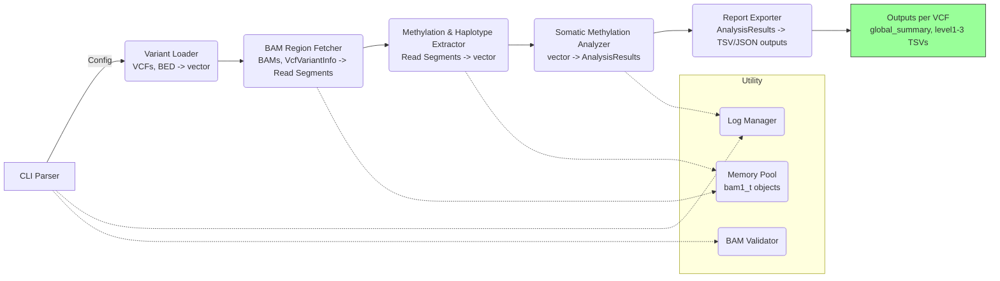

# MethylSomaticAnalysis 開發資訊

* **版本**：v1.0.0
* **發布日期**：2025-05-11
* **版本控制**：GitHub main 分支 + Git 標籤 v1.0.0（Semantic Versioning）
* **License**：GNU GPLv3（GNU General Public License v3.0）

> 本版本遵循語義化版本控制（MAJOR.MINOR.PATCH），確保專案版本清晰可追蹤。 (Semantic Versioning)

## 一、背景與動機

現有的 Somatic small variant calling 工具（如 ClairS 和 DeepSomatic）能夠檢測腫瘤樣本中的突變，但無法有效整合甲基化訊號、phasing/tagging 以及 haplotype 層級的差異分析，缺乏自動化的解決方案。

**MethylSomaticAnalysis** 基於 C++17 和 htslib 高效實現，目標如下：

1. 在指定基因組區域快速擷取 Tumor 和 Normal BAM 檔案中的甲基化讀段。
2. 針對多個 VCF 檔案中的 Somatic 變異，根據 haplotype（h1/h2 及突變讀段 h1-1/h2-1，詳見核心流程）分析其與甲基化的關聯性。
3. 輸出多層次的原始數據與統計結果，支援 Python 或 R 進行後續繪圖與下游生物資訊分析。

### 與現有工具比較

雖然 ClairS、DeepSomatic 等工具在體細胞變異檢測方面表現出色，但 MethylSomaticAnalysis 旨在填補它們在甲基化整合分析方面的空白。

| 特性/工具        | ClairS / DeepSomatic 等主流Somatic Caller | MethylSomaticAnalysis (本工具)                                 |
| :--------------- | :---------------------------------------- | :------------------------------------------------------------- |
| **主要功能** | 體細胞變異檢測 (SNV/Indel)                  | 體細胞變異的甲基化關聯分析                                         |
| **核心輸入** | Tumor/Normal BAM, Reference FASTA         | Tumor/Normal BAM (需含甲基化標籤), Reference FASTA, Somatic VCF(s) |
| **核心輸出** | VCF 檔案                                  | 多層級 TSV 檔案 (原始甲基化、位點摘要、群組統計)，全域摘要         |
| **甲基化整合** | 通常無直接整合                              | 核心功能，分析甲基化與等位基因、Haplotype 的關聯                    |
| **Haplotype分析**| 依賴上游 phasing 工具，自身不直接利用HP標籤 | 直接利用 BAM 中的 HP/PS 標籤進行分層分析                           |
| **預期執行時間** | (依資料量而定，數小時至數十小時 for WGS)    | 較快 (因僅分析 VCF 指定位點周邊，數十分鐘至數小時 for WGS VCFs)    |
| **預期記憶體** | (依資料量而定，數十 GB for WGS)             | 中等 (數 GB 至數十 GB，可透過 `--max-read-depth` 控制)              |
| **主要差異化** | 高靈敏度/精確度的變異檢測                   | 自動化整合變異、甲基化、Haplotype 資訊，提供多維度下游分析數據     |

> **補強建議**：此表格為示意，實際效能指標需通過基準測試獲得。AI 在生成程式碼時，應以此為目標設計高效的資料處理流程。
> ⚠️ 注意：本專案優先確保功能正確、流程穩定且錯誤輸出完整；資訊安全與臨床法規（如 GDPR 或 HIPAA）非首要範圍。

## 二、整體架構圖mermaid



**圖 1：** MethylSomaticAnalysis 執行流程 (v1.0.0)

架構從命令列解析開始，經過變異載入（支援多個 VCF）、BAM 有效性驗證、BAM 區域擷取、甲基化與 Haplotype 資訊提取、Somatic 變異與甲基化關聯分析，最終為每個輸入的 VCF 匯出結構化結果。

**Utility 元件說明**：

* **Log Manager (L1)**：由 `main()` 初始化，為全域可訪問的日誌記錄器 (例如 Meyers Singleton 或注入依賴)，供各模組 (如 `CLI Parser`, `SomaticMethylationAnalyzer`) 記錄不同級別的訊息。其生命週期持續到程式結束。
* **Memory Pool (L3)**：主要由 `BamFetcher` 和 `MethylHaploExtractor` 在讀取和處理 BAM 記錄 (`bam1_t`) 時使用，以減少頻繁的記憶體分配和釋放開銷。可在 `BamFetcher` 初始化時建立，在其處理完畢後釋放。
* **BAM Validator (L4)**：在 `CLI Parser` 解析完參數後，由主控流程調用，用於驗證輸入 BAM 檔案的標籤和索引完整性。其生命週期僅限於啟動時的驗證階段。

> **補強建議**：流程圖中的 I/O 型別 (`vector<VcfVariantInfo>`, `vector<MethylationSiteDetail>`, `AnalysisResults`) 提供了模組間介面的初步定義，AI 產碼時應參考 `Types.h` (詳見章節十七) 中的具體結構。

## 三、環境依賴

| 相依         | 版本要求      | 用途                                                            | 必選/選用 |
| :----------- | :------------ | :-------------------------------------------------------------- | :-------- |
| Ubuntu       | 20.04 LTS     | 作業系統                                                          | 必選      |
| GCC          | ≥ 9.4.0       | C++17 編譯 + OpenMP                                             | 必選      |
| CMake        | ≥ 3.16        | 建置系統                                                          | 必選      |
| htslib       | ≥ 1.17        | BAM / VCF I/O                                                 | 必選      |
| Boost        | ≥ 1.70.0      | `boost::lockfree::queue` 用於 MemoryPool (若選擇此實現)             | 必選      |
| fmtlib       | ≥ 7.0.0       | 高效能字串格式化 (用於 LogManager)                                | 必選      |
| GoogleTest   | ≥ 1.10.0      | 單元/整合/效能測試                                                    | 選用 (測試時) |
| rapidjson    | ≥ 1.1.0       | JSON 輸出 (若需JSON格式的 global_metrics)                      | 選用      |
| Python       | 3.8+          | 執行 `scripts/` 下的繪圖腳本 (需 pandas, matplotlib, plotly)      | 選用 (繪圖時) |
| R            | 4.0+          | (選用) R 繪圖腳本 (需 ggplot2, dplyr)                             | 選用 (繪圖時) |

> **Boost 依賴說明**：若 `MemoryPool` 採用 `boost::lockfree::queue` 實現，則 Boost 為必選。此佇列本身為無鎖設計，但在生產者/消費者模型中需仔細管理物件生命週期以確保執行緒安全。(boost.org)
> **fmtlib 依賴說明**：`fmt::format` 用於日誌系統，提供 Python 風格的格式化功能。
> 環境依賴明確，版本要求具體，確保相容性與可重現性。

## 四、資料夾結構與用途text

```text
MethylSomaticAnalysis/
├── CMakeLists.txt        # 建置設定
├── LICENSE               # 授權文件 (GPLv3)
├── README.md             # 專案簡介與使用說明
├── docs/                 # Markdown + Doxygen 原始文件
│   ├── architecture.md   # 本文件 (或其源文件)
│   └── THIRD_PARTY_NOTICES.md # 第三方庫授權條款
├── include/              # Public headers (依命名空間組織)
│   └── msa/              # Project root namespace
│       ├── core/         #   e.g., Config.h, Types.h, VariantLoader.h
│       └── utils/        #   e.g., LogManager.h, MemoryPool.h
├── src/                  # 核心程式碼 (依命名空間組織, 每模組 1 檔)
│   └── msa/
│       ├── core/         #   e.g., Config.cpp, VariantLoader.cpp
│       └── utils/        #   e.g., LogManager.cpp, MemoryPool.cpp
│   main.cpp              # 主程式入口
├── tests/                # 單元、整合、效能測試
│   ├── data/             # 小型測試資料集 (BAM, VCF, FA, BED)
│   ├── CMakeLists.txt    # 測試建置設定
│   ├── unit/             # 單元測試
│   ├── integration/      # 整合測試 (含 run_small.sh 黃金測試腳本)
│   └── benchmark/        # 效能測試 (使用 Google Benchmark)
├── scripts/              # Python/R 繪圖腳本
└── results/              # 預設輸出總目錄 (可由 --outdir 指定)
    └── <vcf_basename_1>/ # 第一個 VCF 的結果
    │   ├── global_summary_metrics.tsv
    │   ├── level1_raw_methylation_details.tsv.gz
    │   ├── level2_somatic_variant_methylation_summary.tsv.gz
    │   └── level3_haplotype_group_statistics.tsv
    └── <vcf_basename_2>/ # 第二個 VCF 的結果
        └── ...
```

> **命名空間規範**：`include/msa/core/Module.h` 中的類別應屬於 `namespace msa::core { class Module {...}; }`。源檔案 `src/msa/core/Module.cpp` 同樣遵循此命名空間。此規範有助於 AI 生成結構化的程式碼，避免全域命名衝突。
> **注意**：`results/` 目錄下會為每個輸入的 VCF 檔案名稱（去除路徑和 `.vcf.gz` 後綴）建立子目錄，存放其分析結果。

### 五、CLI 參數與驗證

| 參數                 | 縮寫   | 型別               | 必要 | 預設        | 範圍/格式                             | 說明                                             |
| :----------------- | :--- | :--------------- | :- | :-------- | :-------------------------------- | :--------------------------------------------- |
| `--vcfs`           | `-v` | `vector<string>` | Y  | —         | .vcf.gz (需 .tbi，可多個檔案)            | 一或多個 Somatic VCF 檔案路徑                          |
| `--ref`            | `-r` | `string`         | Y  | —         | .fa/.fasta (需 .fai)               | 參考基因組                                          |
| `--tumor`          | `-t` | `string`         | Y  | —         | .bam (需 .bai), or `-` for stdin   | Tumor BAM (需含甲基 HP/PS 標籤)，或從標準輸入讀取      |
| `--normal`         | `-n` | `string`         | Y  | —         | .bam (需 .bai), or `-` for stdin   | Normal BAM (需含甲基 HP/PS 標籤)，或從標準輸入讀取     |
| `--window`         | `-w` | `int`            | N  | 2000      | 1–100000                          | 變異點擷取區域半徑 (bp)                                 |
| `--bed`            | `-b` | `string`         | N  | —         | .bed                              | 限定分析區域 (VCF中在此區域外的變異將被忽略)                      |
| `--meth-high`      | —    | `float`          | N  | 0.8       | 0.01–1.0                          | 高甲基閾值 (用於定義 `meth_state`)                      |
| `--meth-low`       | —    | `float`          | N  | 0.2       | 0.01–1.0 (需 `< meth-high`)        | 低甲基閾值 (用於定義 `meth_state`)                      |
| `--min-allele`     | `-a` | `int`            | N  | **0** | **≥ 0** | **每個變異至少需有此數量 Tumor BAM 支持 ALT 讀數，才進行後續甲基化分析** |
| **`--min-strand-reads`** | **—** | **`int`** | **N** | **1** | **≥ 0** | **每個 CpG 位點在正反鏈上各自至少需要的支持讀數 (用於 Level 1/2 分析前)** |
| `--log-level`      | —    | `string`         | N  | info      | trace/debug/info/warn/error/fatal | 日誌級別                                           |
| `--threads`        | `-j` | `int`            | N  | CPU cores | 1–N                               | 執行緒數                                           |
| `--outdir`         | `-o` | `string`         | N  | ./results | —                                 | 輸出總路徑 (若 stdout 用 `-`，則此參數通常不與之同時使用) |
| `--gzip-output`    | —    | `bool`           | N  | true      | true/false                        | 是否 gzip 壓縮 Level 1 & 2 TSV 輸出                  |

#### 驗證與錯誤處理

1. **檔案存在性/權限**、**索引檔案**、**BAM 內容驗證** (甲基化/Haplotype標籤處理邏輯同前次修訂)、**參數範圍** (`meth-low < meth-high`, `window`範圍, `max-read-depth`範圍, `--min-strand-reads` 範圍)、**目錄行為**、**錯誤輸出**、**BED/VCF區域**處理邏輯均如前次修訂。
2. 新增參數 `--max-read-depth`, `--max-ram-gb`, 和 `--min-strand-reads` 會被CLI解析器解析並存入 `Config` 物件，供後續流程參考。
3. 若 `--tumor` 或 `--normal` 指定為 `-`，則程式應從標準輸入讀取 BAM 資料流。此時，對應的索引檔案 (BAI) 需預先載入或不可用，可能限制區域性擷取功能，或要求 BAM 流包含所有需要的 reads。 `--outdir` 與 stdout (`-`) 的組合需謹慎處理；若主要輸出也導向 stdout，則 `--outdir` 可能用於日誌或其他輔助檔案。

### Exit Codes 定義

程式終止時會返回特定的 Exit Code：

* `0`: 成功完成。
* `1`: 一般性錯誤 (未特定分類的錯誤)。
* `2`: 無效的命令列參數或參數組合。
* `3`: 輸入檔案錯誤 (如檔案不存在、無讀取權限、格式錯誤、索引缺失)。
* `4`: 參考基因組錯誤。
* `5`: BAM 檔案相關錯誤 (如標籤缺失導致無法進行核心分析)。
* `6`: BED 檔案相關錯誤。
* `10`: 資源不足 (如記憶體分配失敗，雖有 `--max-ram-gb` 但主要靠作業系統管理)。
* `11-20`: 內部邏輯錯誤 (各模組可自訂)。

> AI 進行單元測試或整合測試時，應檢查特定失敗情境是否返回對應的 Exit Code。

#### 範例執行指令bash

```bash
./MethylSomaticAnalysis \
  --vcfs /path/to/tp.vcf.gz /path/to/fp.vcf.gz \
  --ref /path/to/hg38.fa \
  --tumor /path/to/tumor_phase.bam \
  --normal /path/to/normal_phase.bam \
  --window 2000 \
  --bed /path/to/regions.bed \
  --meth-high 0.8 \
  --meth-low 0.2 \
  --min-strand-reads 2 \
  --log-level debug \
  --threads 16 \
  --outdir ./my_analysis_results \
  --gzip-output true
```

**使用標準輸入/輸出範例 (Piping)**：

```bash
samtools view -h /path/to/tumor_phase.bam chr1:1000-2000 | \
MethylSomaticAnalysis \
  --vcfs /path/to/chr1_variants.vcf.gz \
  --ref /path/to/hg38.fa \
  -t - \ # Tumor BAM from stdin
  -n /path/to/normal_phase.bam \ # Normal BAM from file
  -o ./piping_results \
  # ... other parameters ...
# Note: When using stdin for BAM, ensure the VCFs are relevant to the piped region
# or that the tool can handle streamed BAMs without full indexing for all operations.
# Outputting results to stdout can also be enabled, e.g., by specifying '-' to an output file parameter if supported.
```

> **(開發)測試範例**：
>
> ```bash
> /big8_disk/liaoyoyo2001/MethylSomaticAnalysis/build/MethylSomaticAnalysis \
>   -n /big8_disk/data/HCC1395/ONT_5khz_simplex_5mCG_5hmCG/HCC1395BL.bam \
>   -t /big8_disk/data/HCC1395/ONT_5khz_simplex_5mCG_5hmCG/HCC1395.bam \
>   -v /big8_disk/liaoyoyo2001/HCC1395_methylation_analysis/VCF/longphase_somatic_PASS_snv_tp_fixed.vcf.gz /big8_disk/liaoyoyo2001/HCC1395_methylation_analysis/VCF/longphase_somatic_PASS_snv_fp_fixed.vcf.gz \
>   -r /big8_disk/ref/GRCh38_no_alt_analysis_set.fasta \
>   -o /big8_disk/liaoyoyo2001/MethylSomaticAnalysis/results \
>   --threads 64 \
>   -b /big8_disk/data/HCC1395/SEQC2/High-Confidence_Regions_v1.2.bed \
>   -w 2000 \
>   --min-strand-reads 2
> ```

### 六、輸入資料格式範例

#### 1. VCF 檔案 (`--vcfs`)

```vcf
##fileformat=VCFv4.2
##FILTER=<ID=PASS,Description="All filters passed">
##source=ClairS
##clairs_version=0.4.0
##bcftools_viewCommand=view -h somatic_PASS_snv.vcf.gz; Date=Mon Mar 10 05:00:53 2025
#CHROM  POS      ID  REF  ALT    QUAL    FILTER  INFO                  FORMAT                          SAMPLE
chr1    877772   .   G    C      0.9465  PASS    .                     GT:GQ:DP:AF:AD                   0/1:0.9465:58:0.7241:0,42
chr1    1004726  .   G    A      0.9744  PASS    .                     GT:GQ:DP:AF:AD                   0/1:0.9744:66:0.4091:0,27
chr1    1049980  .   G    C      0.9958  PASS    .                     GT:GQ:DP:AF:AD                   1/1:0.9958:49:1.0000:0,49
```

* **CHROM**：染色體名稱
* **POS**：變異位置（1-based）
* **REF**、**ALT**：參考與替代等位基因
* **QUAL**、**FILTER**：品質分數與過濾狀態
* **INFO**：可留空（`.`）或填結構變異註記，如 `SVTYPE=DEL`
* **FORMAT**：子欄位標頭（至少 `GT:DP:AF:AD`）
* **SAMPLE**：對應格式的樣本值；`AD` 第二值即腫瘤樣本 ALT 支持數，用於 `--min-allele` 過濾

---

### 2. BAM 檔案 (`--tumor`, `--normal`)

BAM (Binary Alignment Map) 檔案需要包含比對讀段，並且為了進行甲基化和單倍型分析，應包含特定的標籤 (`MM`/`ML` 和 `HP`/`PS`)。以下為 SAM 格式表示的範例（BAM 是其二進制格式）。

---

### 核心欄位（前 11 個，以 TAB 分隔）

| 欄位    | 內容                                     | 說明                         |
| ----- | -------------------------------------- | -------------------------- |
| QNAME | `d2ff1d45-1cac-450c-9633-40c7d8156bf2` | 讀段識別符 (read name)          |
| FLAG  | `0`                                    | 比對標誌 (bitwise flag)        |
| RNAME | `chr1`                                 | 參考序列名稱 (reference name)    |
| POS   | `10001`                                | 1-based 比對起始位置             |
| MAPQ  | `60`                                   | Mapping quality            |
| CIGAR | `760S31M1D11M…` (省略)                   | 對齊操作字串                     |
| RNEXT | `*`                                    | Mate reference name（此處無夾點） |
| PNEXT | `0`                                    | Mate position              |
| TLEN  | `0`                                    | Template length            |
| SEQ   | `AACCCTAACCCTAACC…` (省略)               | 讀段序列 (read sequence)       |
| QUAL  | `*.6>><?=>?@=<@?@?>><=…` (省略)          | Phred 序列品質值                |

---

### 重要附加標籤

* **MM\:Z:**
  描述 DNA 修飾 (modification) 匹配模式，例如

  ``` bam tag
  MM:Z:C+h?,425,2,2,2,5,5,2,2…  
  ```
  
  表示在 C（胞嘧啶）上偵測到 h (5-hmC) 修飾，第一個修飾位置的 likelihood 跳過 425 個相同鹼基後，再依序 2、2、2…
* **ML\:B:C**
  對應 MM 中每個修飾的 Phred-scaled likelihood 陣列 (0–255)，例如

  ``` bam tag
  ML:B:C,1,31,2,1,0,2,1,1,2,7,…
  ```

* **HP\:i:**
  單倍型 (haplotype) 標識符，例如

  ``` bam tag
  HP:i:2  
  ```

* **PS\:i:**
  相位集 (phase set) 標識符，將屬於同一 haplotype 的讀段分組，例如

  ``` bam tag
  PS:i:10821  
  ```

* **其它常見標籤：**
  * `tp:A:P`：primary alignment
  * `cm:i`, `s1:i`, `s2:i`…：校正與比對分數
  * `st:Z:`：處理時間戳記 (ISO 8601)
  * `fn:Z:`：原始檔名
  * `sv:Z:`：信號檔格式 (e.g. "pa")
  * `rl:i:`：讀段長度 (read length)

### 範例擷取結果

```text
讀段名稱 (QNAME):  d2ff1d45-1cac-450c-9633-40c7d8156bf2
比對標誌 (FLAG):   0
參考序列 (RNAME):  chr1
起始座標 (POS):    10001
MAPQ:              60
CIGAR:             760S31M1D11M… (省略)
序列 (SEQ):        AACCCTAACCCTAACCCTAACCCTAACCCTTAACCCCTAACCCCTAACCCTAACCCTAACCCTAACCCTA… 
品質 (QUAL):       *.6>><?=>?@=<@?@?>><=… (省略)

─── 附加標籤 ───
MM:Z:C+h?,425,2,2,2,5,5,2,2…
ML:B:C,1,31,2,1,0,2,1,1,2,7,2,1,1,2,3,0,3,1,7,42,1,0,0,1,62,49,57,130,94…
HP:i:2
PS:i:10821
```

* **標籤開頭**：如 `MM:Z:C+m,5,10;`，`C+m` 表示正鏈 C 有 5mC 修飾
* **第一個數字（5）**：從讀段第 1 碱基起，跳過 5 個 C → 第 6 個 C 帶修飾
* **後續數字（10）**：以上一修飾位點為起點，再跳過 10 個 C → 下一修飾位於原位置 +10
* **依序累加**：每個數字都相對於前一修飾位置累加，直到清單結尾的分號
* **品質對應**：`ML:B:C:` 裡的值（0–255）依序對應每個累加後的修飾位置，表示可信度

#### 3. BED 檔案 (`--bed`)

指定處理範圍的基因組區域（0-based start, end 半開區間）：

```bed
chr1    16241   16249
chr1    17480   17496
chr1    52189   52195
chr1    52196   52204
```

* **chrom**：染色體
* **chromStart**：0-based 起點
* **chromEnd**：0-based 開放性終點

工具僅分析落在這些區間內的 VCF 變異。

#### 4. 參考基因組 FASTA 檔案 (`--ref`)

標準 FASTA 格式，並建立索引 (`.fai`)：

```fasta
>chr1  AC:CM000663.2  LN:248956422  M5:6aef...  AS:GRCh38
NNNNNNNNNNNNNNNNNNNNNNNNNNNNNNNNNNNNNNNNNNNNNNNN
AGCTAGCATCGATCGATCGATCGATCGATCGATCGATCGATCGATCGA
...
>chr2 ...
```

* 工具需此檔對齊與注釋使用，請事先索引。

### 七、模組化與擴充設計

| 功能             | 抽象介面              | 擴充方式                  | 註冊範例                                                                   |
| :--------------- | :-------------------- | :------------------------ | :------------------------------------------------------------------------- |
| 統計分析方法     | `IAnalysisMethod`     | 函式註冊（`std::function`） | `AnalysisMethodRegistry::register("t_test", tTestFunc);`                   |
| 甲基化標籤解析策略 | `IMethylParser`       | 策略註冊                  | `MethylParserRegistry::register("MMML_ONT", createMMMLParser());`          |
| 結果匯出格式     | `IExporter`           | 工廠模式                  | `ExporterRegistry::register("tsv_level1", createTsvLevel1Exporter());`     |
| 日誌             | `ILogger`             | Policy-based template     | `LogManager::setBackend<ConsoleLogger>();`                                 |

**註冊中心生命週期與執行緒安全**：

* `AnalysisMethodRegistry` 和 `MethylParserRegistry` 等註冊中心應設計為 Meyers Singleton (靜態區域變數，C++11 後初始化執行緒安全) 或在 `main()` 函數中創建並作為依賴注入到需要的模組。
* 若註冊操作僅在程式啟動時單執行緒環境下進行，則不需要額外互斥鎖。若允許在運行中動態註冊 (較不常見於此類工具)，則註冊函式需使用 `std::mutex` 保護共享資料結構，防止資料競爭。本專案假設註冊在啟動時完成。

**模組介面強化建議**：
為進一步提升模組化程度與 AI 生成 Adapter Code 的便利性，各核心模組的輸入/輸出應明確定義其資料結構與格式。例如：

* **VariantLoader**:
  * Input: `Config` (VCF paths, BED path)
  * Output: `std::vector<VcfVariantInfo>`
* **BamRegionFetcher**:
  * Input: `Config` (BAM paths), `std::vector<VcfVariantInfo>`
  * Output: `std::map<std::string, std::vector<bam1_t*>>` (e.g., mapping variant ID to associated reads) or directly streams reads to Extractor.
* **Methylation & Haplotype Extractor**:
  * Input: Read segments (e.g., `bam1_t*`), `Config` (MM/ML parsing details, HP/PS logic)
  * Output: `std::vector<MethylationSiteDetail>` (where `MethylationSiteDetail` is a well-defined struct, potentially in JSON/TSV serializable format if intermediate files were used, though direct struct passing is more efficient).
* **Somatic Methylation Analyzer**:
  * Input: `std::vector<MethylationSiteDetail>`, `Config` (statistical parameters, `--min-strand-reads`)
  * Output: `AnalysisResults` (containing Level 2, Level 3 summaries, and global metrics)
* **Report Exporter**:
  * Input: `AnalysisResults`, `Config` (output paths, gzip flag)
  * Output: TSV/JSON files on disk.

明確這些介面（尤其是在 `Types.h` 中定義的結構）有助於獨立開發、測試各模組，並為自動化流程或 AI 輔助開發提供清晰的契約。

## 八、記憶體與執行緒安全

* **RAII**：所有 htslib 物件（如 `bam1_t`、`bcf1_t`）使用 `std::unique_ptr` 搭配自訂 deleter 自動釋放。
* **MemoryPool**：使用 `boost::lockfree::queue` 儲存預分配的 `bam1_t*`，分析結束時呼叫 `MemoryPool::releaseAll()` 回收。
  * **容量計畫**: MemoryPool 可設計為每個工作執行緒預分配固定數量 (例如 100-1000 個) 的 `bam1_t` 物件。若執行緒耗盡其私有池或全域池中的物件，MemoryPool 可以記錄警告並嘗試動態分配新物件，直到達到一個可配置的全域上限 (例如，總共不超過 `--max-ram-gb` 估算的一部分，或一個固定的物件數量上限)。或者，可以選擇阻塞等待物件歸還。AI 實現時應優先考慮預分配和回收，動態擴展作為備案。
  * **Thread-local Cache**：每個執行緒持有獨立的 `bam_hdr_t*` 和 BAM iterator，禁止跨執行緒共享寫操作。
  * **OpenMP 配置**：設置 `omp_set_nested(0); omp_set_dynamic(0);`，防止嵌套並行或動態執行緒重入。
  * **Jemalloc 配置**：在連結階段加入 `-ljemalloc`，並可透過環境變數 `MALLOC_CONF`（如 `oversize_threshold:1,background_thread:true`）自訂配置，以提高大規模記憶體分配效能並減少記憶體碎片。
* **HTSlib 多執行緒注意事項**: (htslib.org)
  * `htsFile*` (檔案控制代碼)、`bam_hdr_t*` (BAM 標頭)、`hts_idx_t*` (索引) 和 `hts_itr_t*` (迭代器) **不是** 執行緒安全的。每個需要進行 I/O 操作的執行緒必須擁有自己獨立的這些物件的實例。例如，若多執行緒讀取同一 BAM 檔案的不同區域，每個執行緒應獨立 `sam_open()`, `sam_hdr_read()`, `bam_idx_load()`, `sam_itr_querys()`。
  * `bam1_t` (BAM 記錄) 物件本身，一旦從檔案中讀取並填充完畢 (例如通過 `sam_read1()`)，並且不再被原始讀取它的 htslib 函數修改，則可以安全地在執行緒間傳遞 (唯讀) 或進行每個執行緒獨立的修改 (若有副本)。MemoryPool 管理的 `bam1_t` 在被一個執行緒使用時，不應被其他執行緒訪問。

### 九、核心流程詳解

1. **參數解析與配置** (ConfigParser, BAMValidator)
      * **輸入**：CLI 參數
      * **輸出**：Config 物件，含所有參數值與驗證後的檔案路徑
      * **邏輯**：使用 cxxopts 解析並驗證檔案、呼叫 BAMValidator 檢查標籤與檔案完整性。
      增加 `--max-read-depth`, `--max-ram-gb`, `--min-strand-reads` 存入 Config。
      * **VariantLoader** 讀取並只保留 Tumor BAM 中支持 ALT ≥ `min_allele` 的變異，將結果排序。
      * 輸出 `std::vector<VcfVariantInfo>`。

2. **變異與區域載入** (VariantLoader, BedLoader, IntervalTree)
      * **輸入**：`--vcfs`, `--bed`
      * **輸出**：`std::vector<VcfVariantInfo>` 列表 (包含 `variant_type` 及校正後的 `pos`)
      * **邏輯**：迭代讀取 VCF，解析 `ALT` 欄位或 `INFO` 欄位中的 `SVTYPE` (若存在) 以判斷 `variant_type` (如 SNV, INDEL)。對於 INDEL，`pos` 指的是其在參考基因組上的第一個鹼基對應位置。使用 htslib 串流與 IntervalTree 過濾（若提供 `--bed`）。若 `--bed` 指定區域與 VCF 變異無交集，記錄日誌。合併並排序變異。
      * 對該 VCF 的排序後變異，使用 OpenMP 按染色體或 variant batch 平行呼叫 `BamFetcher`。
      * 每執行緒獨立開啟 Tumor/Normal BAM (`sam_open` … `sam_close`)，並提取窗口內 `bam1_t`。

3. **BAM 區段取回與資訊提取** (BamFetcher, MethylHaploExtractor)

      * **輸入**：排序後變異列表、Tumor/Normal BAM、Config
      * **輸出**：`std::vector<MethylationSiteDetail>`
      * **邏輯**：
        1. 定義窗口 `[pos-window, pos+window]`
        2. 並行擷取 reads，解析 CIGAR 轉換位置
        3. **提取甲基化（MM/ML 標籤）**：
            * 使用 `bam_parse_basemod` 和 `bam_next_basemod` 迭代讀取 MM/ML (或 Mm/Ml) 標籤中的修飾信息。
            * MM/ML 標籤格式通常如 `Mm:Z:C+m,5;C+h,2;...` 或 `MM:Z:C+m,5;C+h,2;...` (htslib 處理 Mm 和 MM 相同)。
            * **修飾代碼 (Modified Base Codes)**:
                * `m`: 5-methylcytosine (5mC)
                * `h`: 5-hydroxymethylcytosine (5hmC)
            * **Quality ( likelihood / probability ) 解讀**: 緊隨修飾代碼後的數字 (0-255) 代表修飾存在的 Phred-scaled likelihood。通常轉換為概率 `P = 10^(-Q/10)`，或直接使用該值除以 255 作為概率的近似。例如，`C+m,5` 中的 `5` 是 likelihood score。`bam_parse_basemod` 處理後，`mods[i].qual` 欄位會儲存此值。
            * **解析範例字串 `Mm:Z:C+m,5,12;`**:
                * `C`: 表示修飾發生在 C鹼基上。
                * `+`: 表示正鏈上的修飾 (相對於讀段本身)。`-` 表示負鏈。
                * `m`: 表示 5mC 修飾。
                * `,5`: 表示第一個 `m` 修飾的 likelihood/quality score 為 5。
                * `,12`: 表示跳過 12 個未修飾的 C 鹼基後，遇到下一個修飾（如果有的話）。分號 `;` 分隔不同修飾類型或位置組。
                * 程式需迭代處理這些 `base,offset,likelihood;...` 的模式。
        4. **提取 Haplotype（HP/PS 標籤）**：
            * `HP:i:<value>`: Haplotype identifier。通常 `1` 或 `2`。若 HP 值 > 2 (如 3, 4,...), 根據專案需求，可將其全部分類為 `h_other`，或採取更細緻的分組策略（例如，保留原始 HP 值，或將 `HP > 2` 的值視為獨立的 Haplotype 群組）。本工具預設將 `HP > 2` 或無 HP 標籤的歸類為 `haplotype_tag = 0` (unknown/other) 或一個特定的 `h_other` 類別，除非另有配置。
            * `PS:i:<value>`: Phase set identifier。PS 標籤用於將來自同一原始 DNA 分子（在一個 phasing 區域內）的讀段分組。具有相同 PS 值的讀段被認為屬於同一個 phase set，這對於確定哪些 HP:1 和 HP:2 讀段是相互關聯的（即，它們共同定義了一個局部單倍型）至關重要。
            * 若 HP/PS 標籤缺失，按「驗證與錯誤處理」中的策略賦予預設值 (e.g., `haplotype_tag = 0` or `NA`)。
        5. 判斷 allele 支持情況並標註。
        6. **記錄額外欄位**：在 `MethylationSiteDetail` 中加入 `read_id`、`vcf_source_id`、`variant_type` 與 `target_variant`（chrom、pos、ref、alt）資訊，以便後續資料對應。
      * **CIGAR 處理範例**：

        ```cpp
        // 假設 read_pos 為 read 上相對座標, cigar 解析結果儲存於 ops
        int ref_pos = target_variant.pos - config.window; // target_variant.pos 是 1-based
        for (auto& op : cigar_ops) {
          char type = op.first;
          int length = op.second;
          if (type == 'M' || type == 'X' || type == '=') {
            // 比對/匹配，將 read 上每個位置映射到參考基因組
            for (int i = 0; i < length; ++i) {
              int current_ref_pos = ref_pos + i; // 0-based ref pos from iteration start
              // 如果此 current_ref_pos (轉換為 1-based for comparison) 在 mods 標籤中，即為甲基化位點
              // 計算和記錄 meth_call 與 meth_state
            }
            ref_pos += length;
          } else if (type == 'I') {
            // 插入：只消耗 read
            // read_pos += length; // No change to ref_pos
          } else if (type == 'D') {
            // 刪除：只消耗參考
            ref_pos += length;
          }
          // 其他 CIGAR 如 N,S,H 可依需處理或跳過
        }
        ```

      * **甲基讀取 範例(依實際程式流程修改)**：(此範例已包含 `modified_base == 'm'` 的處理，可擴展支持其他修飾類型如 'h', 'a' 等，只需在 `if (mods[i].modified_base == 'm')` 條件中加入 `|| mods[i].modified_base == 'h'` 等，或使用 switch 語句處理不同 `modified_base`。)

        ```cpp
        // ... (previous bam_parse_basemod logic) ...
        // Iterate over all modifications in the read
        while ((n_mods_retrieved = bam_next_basemod(aln, modState, mods, HTS_MAX_BASE_MOD, &readPos0)) > 0) {
            for (int i = 0; i < n_mods_retrieved; i++) {
                // Example: Handle 5mC ('m') and 5hmC ('h')
                if (mods[i].modified_base == 'm' || mods[i].modified_base == 'h') {
                    char current_mod_char = mods[i].modified_base; // e.g., 'm' or 'h'
                    // ... (rest of the logic for position mapping and probability)
                    // Store current_mod_char along with methylation record if needed for specific analysis of 'm' vs 'h'
                    // For general methylation state, they might be combined or handled based on analysis goals.
                    // records.push_back({refPos0 + 1, prob, (meth_status == 1), (meth_status == -1), strand_flag, current_mod_char});
                }
                // Add more cases for other modification types like 'a' for 6mA etc.
            }
        }
        // ...
        ```

4. **Somatic 變異甲基化分析** (SomaticMethylationAnalyzer)
      * **輸入**：`MethylationSiteDetail` 列表、Config (包含 `--min-strand-reads`)
      * **輸出**：Level 2 統計、Level 3 聚合結果，以及用於 `global_summary_metrics.tsv` 的全域統計數據。
      * **邏輯**：
          * **雙股覆蓋篩選 (Pre-analysis filter for Level 1/2)**: 在進行 Level 1 原始位點列表生成或 Level 2 統計聚合前，對每個 CpG 位點檢查其在正鏈和反鏈上是否均至少有 `--min-strand-reads` 指定數量的支持讀數。不符合此條件的 CpG 位點的甲基化信息可能被標記為低可信度或從某些下游統計中排除。此篩選有助於減少僅由單鏈支持的潛在高假陽性甲基化 call。
          * Level 2：根據 (`vcf_source_id`, `chrom`, `pos`, `variant_type`, `bam_source_id`, `allele_type`, `haplotype`) 分組，計算 reads 及平均甲基化。應用 `--min-strand-reads` 篩選後的位點。
          * Level 3：基於 Level 2 平均值，按 haplotype 與 VCF 來源進行聚合比較，計算差異與 p-value。
          * Global Summary Metrics：匯總處理的變異數、BAM 讀段中與 VCF 位點相關的整體甲基化水平（例如，僅計算符合 `--meth-high` 或 `--meth-low` 設定的甲基化位點的平均值或計數）。
          * 以該 VCF 的所有 `MethylationSiteDetail` 執行 Level 2/3 統計。
          * 統計流程與參數存於 Config（含 `min_allele`, `min_strand_reads`）。

5. **結果匯出** (ReportExporter, TSVExporter, JSONExporter)

      * **輸入**：Level 1\~3 結果、Global Summary Metrics、Config
      * **輸出**：各 `vcf_source_id` 子目錄下的 `global_summary_metrics.tsv`、TSV/JSON 檔案及日誌。
      * **邏輯**：
          * 匯出 `global_summary_metrics.tsv`，包含輸入參數和計算出的全域統計值。
          * 使用預緩衝及 gzip 壓縮輸出 Level 1 & 2。
          * JSONExporter 生成 `global_metrics.json` (若仍需) 及 `progress.bar`。
      * 若主要輸出指定為 `-` (stdout)，則 ReportExporter 應將核心結果（如 Level 1/2/3 TSVs）寫入標準輸出流，而不是檔案。日誌和其他輔助輸出仍可寫入檔案或 stderr。

## 十、結果匯出格式

以下依需求輸出四個層次的 TSV 檔案，欄位排序與對應如下：

1. **Level 0：全域參數與甲基化摘要 (Global Summary Metrics)**

      * **檔案名稱**：`global_summary_metrics.tsv`
      * **意義與資訊**：此檔案旨在提供單次執行針對單一輸入 VCF 的關鍵參數設定和高度概括性的甲基化統計結果。方便快速了解分析的配置和整體甲基化圖譜。染色體 (`chrom`) 資訊在此檔案中通常不作為主要維度，因為它是對整個 VCF（可能跨越多個染色體）在 BAM 中取樣區域的總結。
      * **內容範例** (實際欄位可依需求調整)：
          * **參數區段 (Key-Value Pairs)**：
              * `parameter_name`, `parameter_value`
              * 例如：`vcf_file`, `/path/to/your.vcf.gz`
              * 例如：`reference_genome`, `/path/to/hg38.fa`
              * ... (其他重要參數)
          * **統計數值區段 (Key-Value Pairs or Table)**：
              * `vcf_source_id`: VCF 檔案識別碼
              * `total_somatic_variants_in_vcf`: 輸入 VCF 中的體細胞變異總數
              * `variants_processed_after_filters`: 經過 BED 檔等過濾後實際分析的變異數
              * ... (其他相關統計)
              * `tumor_mean_methylation_at_somatic_sites`: 腫瘤樣本在體細胞變異位點周圍的平均甲基化水平（基於 `meth_state` 為 'high' 或 'mid' 的位點的 `meth_call` 平均值）。
              * `normal_mean_methylation_at_somatic_sites`: 正常樣本在體細胞變異位點周圍的平均甲基化水平（同上）。
              * `tumor_methylated_site_count_at_somatic_sites`: 腫瘤樣本中，在體細胞變異位點周圍被判定為甲基化 (`meth_state` 為 'high' 或 'mid') 的 CpG 位點總數。
              * `normal_methylated_site_count_at_somatic_sites`: 正常樣本中，在體細胞變異位點周圍被判定為甲基化 (`meth_state` 為 'high' 或 'mid') 的 CpG 位點總數。
      * **只計算有甲基的**：在計算平均甲基化水平或甲基化位點計數時，依據 `--meth-high` 和 `--meth-low` 閾值判定的 `meth_state` ('high', 'mid', 'low')。通常 'high' 和 'mid' 狀態的位點被視為有效甲基化位點進行統計。

2. **Level 1：原始甲基位點對應**

      * **檔案名稱**：`level1_raw_methylation_details.tsv(.gz)`
      * **欄位（排序依序）**：
        1. `chrom`：染色體
        2. `methyl_pos`：甲基位於參考基因組座標 (1-based)
        3. `somatic_pos`：Somatic 變異座標 (1-based)。對 INDEL 而言，指其在參考基因組上的第一個鹼基對應位置。
        4. `variant_type`：變異類型 (如 SNV, INDEL)
        5. `vcf_source_id`：VCF 檔案識別碼
        6. `bam_source_id`：Tumor/Normal
        7. `somatic_allele_type`：ref/alt
        8. `somatic_base_at_variant`：Somatic base on read at variant locus
        9. `haplotype_tag`：HP 標籤（排序：1,2,1-1,2-1,0, 或空值/NA 若無標籤）
        10. `meth_call`：甲基化比例 (e.g., probability from read)
        11. `meth_state`：甲基化狀態（high/mid/low/unknown）
        12. `strand`（+/-，指甲基化位點本身或讀段的鏈方向）
        13. `read_id`：讀段 QNAME
      * **排序邏輯**：依序比較每欄位值，確保相同染色體區域集中；haplotype 以預設順序插入。
      * **說明**：輸出每一條有通過 Somatic 位點的read的甲基位點資訊，條列甲基位點的每個數值。

3. **Level 2：每個 Somatic 位點周邊甲基統計**

      * **檔案名稱**：`level2_somatic_variant_methylation_summary.tsv(.gz)`
      * **欄位（排序依序）**：
        1. `chrom`
        2. `somatic_pos` (1-based)
        3. `variant_type`
        4. `vcf_source_id`
        5. `bam_source_id`
        6. `somatic_allele_type`
        7. `haplotype_tag`
        8. `supporting_read_count`
        9. `methyl_sites_count` (分析的 CpG 位點數)
        10. `mean_methylation` (基於 `meth_state` 的聚合結果)
        11. `strand`（+/-/.）：報告相關讀段主要來源鏈；若資訊混合或不明確，則標記為 '.'。
      * **說明**：統計每個 Somatic 突變窗口內符合條件的 read 數、甲基化位點數量與平均值。

4. **Level 3：跨 VCF 與 HP 群組整體比較**

      * **檔案名稱**：`level3_haplotype_group_statistics.tsv`
      * **欄位**：可自訂（範例：`haplotype_group`, `bam_source`, `variant_type_group`, `VCF1_mean_methylation`, `VCF2_mean_methylation`, `difference`, `p_value`）
      * **排序**：按 `bam_source`、`haplotype_group`、`variant_type_group`。
      * **說明**：比較不同 VCF 來源、Tumor/Normal、變異類型群組與 haplotype 組合下的甲基化差異與統計顯著性。

> 每個輸入的 VCF 檔案將在 `--outdir` 下建立對應子目錄，包含上述四個檔案（Level 0-3）；保持一致命名與排序邏輯。

## 十一、測試基準與資料集

| 測試類型        | 樣本規模                                      | Threads | 目標時間    | 峰值記憶體   | 驗證方式                                                                 |
| :-------------- | :-------------------------------------------- | :------ | :---------- | :----------- | :----------------------------------------------------------------------- |
| Unit            | Mocked Data / 單一函式輸入                      | 1       | < 1 s       | < 50 MB      | GoogleTest 斷言                                                          |
| Small (Golden)  | chr22 子集 (例如 10-100 reads, 2-5 variants)    | 1-4     | < 60 s      | < 1 GB       | 比對 Level 2 `mean_methylation` 等關鍵欄位的 SHA256 校驗和或精確值        |
| Integration     | chr22 全長 (1-2 VCFs)                         | 8       | < 600 s     | < 8 GB       | 檢查輸出檔案是否存在、格式是否正確、關鍵統計指標是否在預期範圍內               |
| Full            | Whole-genome (多 VCFs)                        | 16      | < 4 h       | < 32 GB      | 同 Integration，更側重效能與穩定性                                         |

> 使用 Google Benchmark 進行效能測試；若超出閾值，CI 失敗。
> **黃金測試 (Golden Test)**：`tests/data/` 目錄下應包含一組最小化的真實 BAM/VCF/FASTA/BED 檔案。`tests/integration/run_small_golden.sh` 腳本將執行程式並將特定輸出檔案 (或其部分欄位) 的 SHA256 校驗和與預存的「黃金」校驗和進行比對。

## 十二、CMake 配置cmake

```cmake
cmake_minimum_required(VERSION 3.16)
project(MethylSomaticAnalysis VERSION 1.0.0
 LANGUAGES CXX
 DESCRIPTION "Somatic variant methylation analysis tool")

set(CMAKE_CXX_STANDARD 17)
set(CMAKE_CXX_STANDARD_REQUIRED ON)
set(CMAKE_CXX_EXTENSIONS OFF)

# Compiler flags (general, can be augmented by build type)
set(CMAKE_CXX_FLAGS_COMMON "-Wall -Wextra -pedantic")
set(CMAKE_CXX_FLAGS "${CMAKE_CXX_FLAGS_COMMON} ${CMAKE_CXX_FLAGS}")
set(CMAKE_CXX_FLAGS_RELEASE "${CMAKE_CXX_FLAGS_COMMON} -O3 -DNDEBUG")
set(CMAKE_CXX_FLAGS_DEBUG "${CMAKE_CXX_FLAGS_COMMON} -g -O0")

# Find required packages
find_package(Threads REQUIRED)
find_package(ZLIB REQUIRED)
find_package(OpenMP) # Optional, but often used

# HTSLIB
find_path(HTSLIB_INCLUDE_DIR htslib/sam.h)
find_library(HTSLIB_LIB NAMES hts)
if(NOT HTSLIB_INCLUDE_DIR OR NOT HTSLIB_LIB)
  message(FATAL_ERROR "htslib not found.")
endif()
message(STATUS "Found htslib: ${HTSLIB_LIB} (includes: ${HTSLIB_INCLUDE_DIR})")

# Boost (for lockfree queue if used)
find_package(Boost 1.70.0 COMPONENTS system thread REQUIRED) # Add other components if needed
if(Boost_FOUND)
  message(STATUS "Found Boost: ${Boost_INCLUDE_DIRS} (libraries: ${Boost_LIBRARIES})")
else()
  message(FATAL_ERROR "Boost (>=1.70) not found.")
endif()

# fmtlib
find_package(fmt QUIET) # Modern CMake finds fmt::fmt target
if(NOT fmt_FOUND)
    find_path(FMT_INCLUDE_DIR fmt/core.h)
    if(NOT FMT_INCLUDE_DIR)
        message(FATAL_ERROR "fmtlib include directory not found.")
    else()
        message(STATUS "Found fmtlib includes: ${FMT_INCLUDE_DIR} (will link library if available or build as header-only)")
        # If header-only or need to build from source, additional steps might be needed
        # For simplicity, assuming it provides a library target or is header-only accessible
    endif()
else()
    message(STATUS "Found fmtlib via find_package (fmt::fmt)")
endif()

# RapidJSON (Header-only, find include path)
find_path(RAPIDJSON_INCLUDE_DIR rapidjson/document.h
    HINTS ${CMAKE_SOURCE_DIR}/third_party/rapidjson/include ${CMAKE_PREFIX_PATH}/include
)
if (NOT RAPIDJSON_INCLUDE_DIR)
    message(WARNING "RapidJSON include directory not found. JSON output might be unavailable.")
else()
    message(STATUS "Found RapidJSON includes: ${RAPIDJSON_INCLUDE_DIR}")
endif()

# Include directories
include_directories(
  ${HTSLIB_INCLUDE_DIR}
  ${Boost_INCLUDE_DIRS}
  ${FMT_INCLUDE_DIR} # If found via find_path
  ${RAPIDJSON_INCLUDE_DIR}
  "${CMAKE_CURRENT_SOURCE_DIR}/include" # Project's own include directory
)

# Generate export header (good practice for libraries, useful even for executables for version info)
include(GenerateExportHeader)
generate_export_header(methyl_somatic_core
  BASE_NAME MSA
  EXPORT_MACRO_NAME MSA_API
  EXPORT_FILE_NAME "${CMAKE_CURRENT_BINARY_DIR}/include/msa_export.h"
)

# Core library (static for easier distribution of the tool)
add_library(methyl_somatic_core STATIC
  src/msa/core/ConfigParser.cpp
  src/msa/core/BAMValidator.cpp
  # ... other cpp files from src/msa/core and src/msa/utils
  src/msa/utils/LogManager.cpp
  src/msa/utils/MemoryPool.cpp
  src/msa/Types.cpp # Assuming Types.cpp contains definitions if any
)
target_include_directories(methyl_somatic_core PUBLIC
  "${CMAKE_CURRENT_SOURCE_DIR}/include"
  "${CMAKE_CURRENT_BINARY_DIR}/include" # For msa_export.h
)

# Main executable
add_executable(MethylSomaticAnalysis src/main.cpp)

target_link_libraries(MethylSomaticAnalysis
  PRIVATE
    methyl_somatic_core
    Threads::Threads
    ZLIB::ZLIB
    ${HTSLIB_LIB}
    ${Boost_LIBRARIES} # Link Boost components
)
if(fmt_FOUND AND TARGET fmt::fmt)
    target_link_libraries(MethylSomaticAnalysis PRIVATE fmt::fmt)
elseif(FMT_LIBRARY) # If find_library was used for fmt
    target_link_libraries(MethylSomaticAnalysis PRIVATE ${FMT_LIBRARY})
endif()

if(OpenMP_CXX_FOUND)
  target_link_libraries(MethylSomaticAnalysis PRIVATE OpenMP::OpenMP_CXX)
endif()

# Install rules
include(GNUInstallDirs)
install(TARGETS MethylSomaticAnalysis
  RUNTIME DESTINATION ${CMAKE_INSTALL_BINDIR}
)
install(FILES "${CMAKE_CURRENT_SOURCE_DIR}/README.md" "${CMAKE_CURRENT_SOURCE_DIR}/LICENSE"
  DESTINATION ${CMAKE_INSTALL_DOCDIR}/MethylSomaticAnalysis
)
# Example: install public headers if it were a library for others to use
# install(DIRECTORY "${CMAKE_CURRENT_SOURCE_DIR}/include/msa"
#   DESTINATION ${CMAKE_INSTALL_INCLUDEDIR}
# )

# Testing (GoogleTest)
option(MSA_BUILD_TESTS "Build MethylSomaticAnalysis tests" ON)
if(MSA_BUILD_TESTS)
  find_package(GTest REQUIRED) # GoogleTest must be found if building tests
  include(GoogleTest)
  enable_testing()
  # Example: add_executable(msa_unit_tests tests/unit/main_test.cpp tests/unit/some_test.cpp)
  # target_link_libraries(msa_unit_tests PRIVATE GTest::gtest GTest::gtest_main methyl_somatic_core)
  # gtest_discover_tests(msa_unit_tests)
  add_subdirectory(tests) # Assuming tests/CMakeLists.txt configures GTest targets
  message(STATUS "GoogleTest found. Tests will be built.")
else()
  message(STATUS "MSA_BUILD_TESTS is OFF. Tests will not be built.")
endif()

```

## 十三、日誌系統等級與格式

* **等級**：trace \< debug \< info \< warn \< error \< fatal
* **格式**：`[YYYY-MM-DDTHH:MM:SSZ][LEVEL][Module] Message (key1=val1, key2=val2)`

實現：

```cpp
LogManager::getInstance().log(level, module, fmt::format("...", args));
```

同時輸出至 stderr 與 `logs/pipeline.log`，低於 `--log-level` 的訊息僅寫檔。

### 十四、I/O 與效能最佳化

* **VCF/BAM 讀取**：先排序變異以減少隨機 I/O，使用 `hts_itr_querys` 或 `bam_itr_next_blk` 批次讀取。
* **並行處理**：OpenMP 處理不同區域/變異點，每執行緒獨立資源。
* **寫入緩衝**：使用 `std::ostringstream` 緩衝，累積 \~256KB 後 flush。對於標準輸出流 (`-`)，緩衝策略依然適用。
* **壓縮**：Level 1/2 預設 gzip（zlib level 3-6）。若輸出到 stdout，壓縮可能不適用或需由下游工具處理。
* **資料結構**：適時使用 `unordered_map` 提升查找效能。
* **串流處理 (Piping)**：
  * 允許 BAM 輸入來自標準輸入 (`stdin`)，例如 `-t -`。這使得 MethylSomaticAnalysis 可以整合到 Unix 管道中，如 `samtools view ... | MethylSomaticAnalysis ...`。
  * 輸出結果也可以導向標準輸出 (`stdout`)，例如通過特定參數指定輸出檔案為 `-`。
  * 使用管道可以減少對磁碟的中間檔案讀寫，尤其適用於大型資料集的即時處理或工作流程中的串聯步驟。
  * **注意事項**：當從 `stdin` 讀取 BAM 時，可能無法進行隨機存取 (如 `hts_itr_querys`)，除非輸入流是經過特殊準備的 (例如，包含了所有相關區域的讀段)。分析範圍可能受限於輸入流的內容。

## 十五、文件與程式碼同步

* **Doxygen**：CI 自動生成 API 文件至 `docs/api/html/`。
* **architecture.md**：手動更新與代碼同步，使用 mermaid-cli 更新圖表。

## 十六、測試與 CI/CD

**測試指令**：

```bash
# 建置
cmake .. -DCMAKE_BUILD_TYPE=Release -DBUILD_TESTING=ON # Enable tests if GTest is setup
make -j$(nproc)

# 主流程測試（多 VCF 輸出驗證）
VCFS=(tp.vcf.gz fp.vcf.gz)
OUTDIR=./test_results
# Ensure dummy files exist for the test command to pass path checks
touch tp.vcf.gz tp.vcf.gz.tbi fp.vcf.gz fp.vcf.gz.tbi hg38.fa hg38.fa.fai tumor.bam tumor.bam.bai normal.bam normal.bam.bai

./MethylSomaticAnalysis --vcfs \
  tp.vcf.gz fp.vcf.gz \
  --ref hg38.fa \
  --tumor tumor.bam \
  --normal normal.bam \
  --outdir ${OUTDIR} --threads 8

# 驗證每個 VCF 對應子目錄存在
for v_file in "${VCFS[@]}"; do
  basename_vcf=$(basename "$v_file" .vcf.gz)
  if [ ! -d "${OUTDIR}/${basename_vcf}" ]; then
    echo "錯誤：目錄 ${OUTDIR}/${basename_vcf} 不存在" >&2
    exit 1
  fi
  # 驗證 global_summary_metrics.tsv 是否存在
  if [ ! -f "${OUTDIR}/${basename_vcf}/global_summary_metrics.tsv" ]; then
    echo "錯誤：檔案 ${OUTDIR}/${basename_vcf}/global_summary_metrics.tsv 不存在" >&2
    exit 1
  fi
done

echo "測試輸出目錄結構驗證通過。"

# 執行單元/整合測試 (如果已配置)
# cd build && ctest -C Release --output-on-failure
```

**GitHub Actions CI**：

```yaml
name: CI
on: [push, pull_request]
jobs:
  build-test-ubuntu:
    runs-on: ubuntu-latest
    steps:
      - uses: actions/checkout@v3
      - name: Install Dependencies
        run: |
          sudo apt-get update
          sudo apt-get install -y build-essential cmake libhts-dev zlib1g-dev \
                                  libgtest-dev libjsoncpp-dev # For GoogleTest and rapidjson (if system installed)
          # For GoogleTest, often need to build it manually from /usr/src/googletest
          # cd /usr/src/googletest
          # sudo cmake .
          # sudo make
          # sudo cp lib/*.a /usr/lib/
          # sudo mkdir /usr/local/lib/googletest
          # sudo ln -s /usr/lib/libgtest.a /usr/local/lib/googletest/libgtest.a
          # sudo ln -s /usr/lib/libgtest_main.a /usr/local/lib/googletest/libgtest_main.a
      # Create dummy files for CLI test
      - name: Create dummy files for test
        run: |
          touch tp.vcf.gz tp.vcf.gz.tbi fp.vcf.gz fp.vcf.gz.tbi ref.fa ref.fa.fai tumor.bam tumor.bam.bai normal.bam normal.bam.bai
      - name: Configure
        run: cmake -B build -S . -DCMAKE_BUILD_TYPE=Release -DBUILD_TESTING=ON
      - name: Build
        run: cmake --build build --config Release -- -j$(nproc)
      - name: Run CLI Output Structure Tests
        run: |
          mkdir -p test_ci_results
          # Use dummy files created in previous step
          ./build/MethylSomaticAnalysis --vcfs tp.vcf.gz fp.vcf.gz --ref ref.fa --tumor tumor.bam --normal normal.bam -o test_ci_results --threads 4
          for v_base in tp fp; do
            if [ ! -d "test_ci_results/$v_base" ]; then
              echo "Directory test_ci_results/$v_base missing";
              exit 1;
            fi
            if [ ! -f "test_ci_results/$v_base/global_summary_metrics.tsv" ]; then
              echo "File test_ci_results/$v_base/global_summary_metrics.tsv missing";
              exit 1;
            fi
          done
          echo "CLI output structure tests passed."
      - name: Unit & Integration Tests
        run: |
          cd build
          ctest -C Release --output-on-failure
```

## 十七、授權與版權資訊

* **授權**：本專案採用 **GNU GPLv3**（GNU General Public License v3.0）授權條款，詳細條款請參閱 `LICENSE` 檔案，或參考官方條款摘要。[https://www.gnu.org/licenses/gpl-3.0.en.html](https://www.gnu.org/licenses/gpl-3.0.en.html) (GNU)
* **版權**：Copyright © 2025 MethylSomaticAnalysis Development Team
* **第三方相依授權彙整**:
    本專案依賴的第三方函式庫及其授權條款摘要如下。詳細資訊請參閱各函式庫的原始授權文件及本專案 `docs/THIRD_PARTY_NOTICES.md` 檔案。
  * **htslib**: MIT License (htslib.org)
  * **Boost**: Boost Software License (boost.org)
  * **fmtlib**: MIT License
  * **RapidJSON**: MIT License
  * **GoogleTest**: BSD 3-Clause "New" or "Revised" License
  > AI 產碼時，應確保 `docs/THIRD_PARTY_NOTICES.md` 被正確填充。

## 十八、檔案與類別／函式一覽（部分修訂）

此處僅列出主要變更或新增的組件，詳細的類別/函式定義需在開發過程中細化。

1. **核心流程相關**

      * `src/main.cpp`

        ```cpp
        int main(int argc, char** argv) {
          // 初始化，解析參數，協調各模組執行
          // ConfigParser, BAMValidator, VariantLoader, BamFetcher,
          // MethylHaploExtractor, SomaticMethylationAnalyzer, ReportExporter
        }
        ```

      * `src/ConfigParser.cpp` / `include/ConfigParser.h`
          * **Config struct**：新增 `std::vector<std::string> vcf_files;`
          * `parse()`：處理 `--vcfs` 參數
      * `src/BAMValidator.cpp` / `include/BAMValidator.h`

        ```cpp
        class BAMValidator {
        public:
          bool checkAllInputFiles(const Config& config);
          bool checkMethylationTags(const std::string& bamPath, htsFile* fp, bam_hdr_t* hdr, Config& config_warnings);
          bool checkHaplotypeTags(const std::string& bamPath, htsFile* fp, bam_hdr_t* hdr, Config& config_warnings);
        };
        ```

      * `src/Types.cpp` / `include/Types.h`

        ```cpp
        struct VcfVariantInfo {
          std::string vcf_source_id; // Basename of the VCF file
          std::string chrom;
          int pos; // 1-based. For INDELs, this is the first base on the reference.
          std::string ref;
          std::string alt;
          float qual;
          std::string variant_type; // e.g., SNV, INDEL
        };

        struct MethylationSiteDetail {
          std::string chrom;
          int methyl_pos; // 1-based
          int somatic_pos; // 1-based, for INDELs, first ref base
          std::string variant_type;
          std::string vcf_source_id;
          std::string bam_source_id; // Tumor or Normal
          std::string somatic_allele_type; // ref or alt
          std::string somatic_base_at_variant;
          std::string haplotype_tag; // HP tag value (e.g., "1", "2", "0", or "" if missing)
          float meth_call; // Methylation probability (0.0-1.0), or NaN/0 if missing tag
          std::string meth_state; // high, mid, low, unknown (or "" if missing tag)
          char strand; // '+', '-', or '.'
          std::string read_id;
        };

        struct SomaticVariantMethylationSummary {
          std::string chrom;
          int somatic_pos; // 1-based
          std::string variant_type;
          std::string vcf_source_id;
          std::string bam_source_id;
          std::string somatic_allele_type;
          std::string haplotype_tag; // "0" or "" for reads without HP tag or mixed
          int supporting_read_count;
          int methyl_sites_count;
          float mean_methylation;
          char strand; // '+', '-', or '.' (dominant strand from reads, or '.' if mixed/NA)
        };

        struct AggregatedHaplotypeStats { /* Level 3 統計結構 */ };

        struct GlobalSummaryMetrics {
            std::map<std::string, std::string> parameters;
            std::map<std::string, std::string> numeric_metrics_str; // Store metrics as strings for flexible formatting
            // Or specific named fields:
            // std::string vcf_source_id;
            // long total_somatic_variants_in_vcf;
            // ...
        };

        struct AnalysisResults {
            std::vector<MethylationSiteDetail> level1_details;
            std::vector<SomaticVariantMethylationSummary> level2_summary;
            std::vector<AggregatedHaplotypeStats> level3_stats;
            GlobalSummaryMetrics global_metrics;
        };
        ```

      * `src/VariantLoader.cpp` / `include/VariantLoader.h`

        ```cpp
        class VariantLoader {
        public:
          std::vector<VcfVariantInfo> loadVCFs(
            const std::vector<std::string>& vcfPaths,
            const std::string& bedPath, // bedPath can be empty
            Config& config // To log messages
          );
        private:
          std::string determineVariantType(const bcf1_t* vcf_record);
        };
        ```

      * `src/MethylHaploExtractor.cpp` / `include/MethylHaploExtractor.h`

        ```cpp
        class MethylHaploExtractor {
        public:
          MethylationSiteDetail extractFromRead(
            bam1_t* read,
            const VcfVariantInfo& target_variant,
            const Config& config,
            const std::string& bam_source_id
          );
        };
        ```

      * `src/SomaticMethylationAnalyzer.cpp` / `include/SomaticMethylationAnalyzer.h`

        ```cpp
        class SomaticMethylationAnalyzer {
        public:
          void analyze(
            const std::vector<MethylationSiteDetail>& all_site_details,
            AnalysisResults& results_container,
            const Config& config
          );
        };
        ```

      * `src/ReportExporter.cpp` / `include/ReportExporter.h`

        ```cpp
        class ReportExporter {
        public:
          void exportAllResults(
            const AnalysisResults& results,
            const Config& config,
            const std::string& vcf_basename
          );
        };
        ```

      * `src/TSVExporter.cpp` / `include/TSVExporter.h`

        ```cpp
        class TSVExporter {
        public:
          void exportGlobalSummary(const GlobalSummaryMetrics& metrics, const std::string& outputPath, const Config& config);
          void exportLevel1(const std::vector<MethylationSiteDetail>& details, const std::string& outputPath, bool gzip);
          void exportLevel2(const std::vector<SomaticVariantMethylationSummary>& summaries, const std::string& outputPath, bool gzip);
          void exportLevel3(const std::vector<AggregatedHaplotypeStats>& stats, const std::string& outputPath);
        };
        ```

2. **介面定義 (`include/`)**
   * `IAnalysisMethod.h`
   * `IMethylParser.h`
  
  > 根據擴充設計需求進行調整

## 十九、其他非 C++ 原始碼檔案

* **Python 繪圖腳本** (`scripts/`)
  * `plot_global_summary.py`: (新增) 視覺化 `global_summary_metrics.tsv` 中的關鍵參數與統計指標。
  * `plot_level1_details.py`：抽樣繪製特定區域的原始甲基化點，可按 `variant_type`, `haplotype_tag`, `meth_state` 等進行篩選與著色。
  * `plot_level2_summaries.py`：繪製各 somatic variant 的甲基化均值分布（如箱型圖、小提琴圖），可按 `variant_type`, `haplotype_tag`, `bam_source_id` 等進行分組比較。
  * `plot_level3_comparisons.py`：視覺化 Level 3 的聚合統計結果（如熱圖、火山圖、柱狀圖比較不同群組間的甲基化差異與顯著性）。
  * **說明**：所有 Python 腳本需更新以適應 v1.0.0 的四層 TSV 輸出格式，特別是 `global_summary_metrics.tsv` 的解析以及在各層級圖表中正確使用 `variant_type` 欄位。
* `requirements.txt`：包含 Python 腳本所需的庫，如 `pandas`, `matplotlib`, `seaborn`, `plotly`。應根據實際使用的繪圖功能更新。
* **測試輔助腳本** (`tests/integration/`)
  * `run_small.sh`：更新 CLI 用法與預期輸出（包括檢查 `global_summary_metrics.tsv` 的生成）。
* **配置範本與 Schema**
  * `example_config.yaml` (若使用)
  * `config_schema.json` (若使用)

 > 更新以支援 `--vcfs` 並反映 v1.0.0 的參數。

* **CI/CD 及其他設定**
  * Dockerfile, .clang-format, Doxyfile：基本保持，Doxyfile 可能需更新專案版本。
  * CMake：已在「十一、CMake 配置」中更新。

## 二十、總結

本版 v1.0.0 已完成以下項目：

1. **核心功能**

   * CLI 參數解析與驗證（含 `--vcfs`、`--min-allele` 篩選）
   * 多 VCF 子流程並行化處理
   * Tumor/Normal BAM 甲基化（MM/ML）與 Haplotype（HP/PS）標籤擷取
   * CIGAR 轉座標、Somatic ALT 支持判定、`haplotype_tag` 全面對應
   * Level 0–3 統計模式與 TSV 輸出（固定小數四位、無科學記號）
2. **錯誤與資源管理**

   * 完整檔案/索引存在性、標籤缺失警告、非同步日誌
   * MemoryPool 預分配與阻塞等待機制
   * 動態檔案描述符檢查與 thread 數自動調整
3. **建置與測試**

   * 模組化 CMake（含 export header、install 規則）
   * 單元、整合及 Golden Test 腳本
   * CI 增強：FD/記憶體壓力測試

---

## 二十一、未來展望與擴充性考量

1. **進階 INDEL 甲基化分析**

   * 支援插入/缺失導致的 CpG 位點座標重定位與鄰近上下文校正。
2. **多樣本／單細胞擴充**

   * 加入多 Tumor 樣本或單細胞層級分群比對功能（per-cell barcode）。
3. **動態 Plugin 架構**

   * 提供 IAnalysisMethod、IMethylParser、IExporter 的動態註冊與外部套件載入機制。
4. **記憶體與 I/O 優化**

   * 引入 MemoryWatcher 或可插拔 allocator（jemalloc/tcmalloc）動態監控與調整。
5. **Python/R API 綁定**

   * 使用 pybind11 或 Rcpp 封裝核心分析流程，支援程式化呼叫與交互式分析。
6. **雲端／工作流整合**

   * Docker/Singularity 映像檔、Nextflow/Cromwell 模組，可無縫串接 HPC 與雲端環境。
7. **擴展統計模型**

   * 加入貝式推論、多重檢定校正、機器學習模型預測甲基化差異。
8. **可視化與 Web 介面**

   * 實時儀表板（Dash/Streamlit），並支援輸出交互式 HTML 報告。
