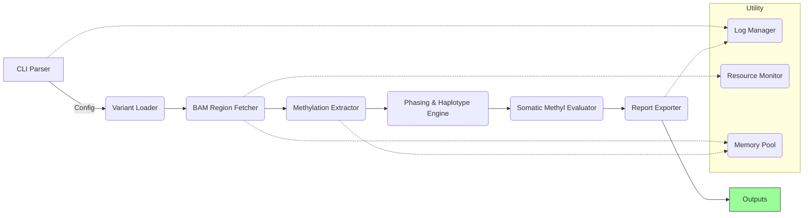

---

# MethylSomaticAnalysis 開發架構與詳細規格文件

## 版本與發佈資訊

| 項目       | 說明                                                       |
|------------|------------------------------------------------------------|
| **版本**   | v1.0.0                                                    |
| **發布日期** | 2025-05-10                                               |
| **版本控制** | GitHub `main` 分支 + Git 標籤 `v1.0.0` (Semantic Versioning) |
| **Licesnse**| CNU 3.0                                                  |

版本遵循語義化版本控制（MAJOR.MINOR.PATCH），確保專案版本清晰可追蹤。

---

## 一、背景與動機

現有的 Somatic small variant calling 工具（如 ClairS 和 DeepSomatic）能夠檢測腫瘤樣本中的突變，但無法有效整合甲基化訊號、phasing/tagging 以及 haplotype 層級的差異分析，缺乏自動化的解決方案。**MethylSomaticAnalysis** 基於 C++17 和 htslib 高效實現，目標如下：

1. 在指定基因組區域快速擷取 Tumor 和 Normal BAM 檔案中的甲基化讀段。
2. 根據 haplotype（h1/h2 及突變讀段 h1-1/h2-1）分析 Somatic 變異與甲基化的關聯性。
3. 輸出原始數據與統計結果，支援 Python 或 R 進行後續繪圖與下游生物資訊分析。

> **注意**：本專案優先確保功能正確、流程穩定且錯誤輸出完整；資訊安全與臨床法規（如 GDPR 或 HIPAA）非首要範圍。

---

## 二、整體架構圖



*圖 1：MethylSomaticAnalysis 執行流程*

架構從命令列解析開始，逐步經過變異載入、BAM 區域擷取、甲基化提取、haplotype 分析、Somatic 變異評估，最終匯出結果，輔以日誌管理、資源監控與記憶體池等工具模組。

---

## 三、環境依賴

| 相依         | 版本        | 用途                    |
|--------------|-------------|-------------------------|
| Ubuntu       | 20.04 LTS  | 作業系統                |
| GCC          | ≥ 9.4.0    | `-std=c++17` + OpenMP  |
| htslib       | 1.17       | BAM / VCF I/O          |
| GoogleTest   | 1.11.0     | 單元/整合/效能測試     |
| rapidjson    | 1.1.0      | JSON 輸出             |
| CMake        | ≥ 3.16     | 建置系統               |

環境依賴明確，版本要求具體，確保相容性與可重現性。

---

## 四、資料夾結構與用途

```plaintext
MethylSomaticAnalysis/
├── CMakeLists.txt        # 建置設定
├── src/                  # 核心程式碼 (每模組 1 檔)
├── include/              # Public headers
├── tests/                # 單元、整合、效能測試
│   ├── unit/             # 單元測試
│   ├── integration/      # 整合測試
│   └── benchmark/        # 效能測試
├── docs/                 # Markdown + Doxygen 原始文件
├── scripts/              # Python 繪圖腳本
└── results/              # 預設輸出 (可由 --outdir 指定)
```

---

## 五、CLI 參數與驗證

| 參數            | 縮寫 | 型別     | 必要 | 預設        | 範圍/格式                           | 說明                                |
|-----------------|------|----------|------|-------------|-------------------------------------|-------------------------------------|
| --vcf           | -v   | string   | +    | —           | .vcf.gz (需 .tbi)                  | Somatic VCF                       |
| --ref           | -r   | string   | Y    | —           | .fa/.fasta (需 .fai)               | 參考基因組                         |
| --tumor         | —    | string   | Y    | —           | .bam (需 .bai)                     | Tumor BAM (含甲基/HP/PS)          |
| --normal        | -n   | string   | Y    | —           | .bam (需 .bai)                     | Normal BAM                        |
| --window        | -w   | int      | N    | 2000         | 1–100000                          | 區域半徑 (bp)                     |
| --bed           | -b   | string   | N    | —           | .bed                               | 限定分析區域                       |
| --tp-vcf        | —    | string   | +    | —           | .vcf.gz (需 .tbi)                  | Gold truth TP VCF                 |
| --fp-vcf        | —    | string   | +    | —           | .vcf.gz (需 .tbi)                  | Gold truth FP VCF                 |
| --meth-high     | —    | float    | N    | 0.8         | 0–1                                | 高甲基閾值                        |
| --meth-low      | —    | float    | N    | 0.2         | 0–1, < meth-high                   | 低甲基閾值                        |
| --log-level     | -l   | string   | N    | info        | trace/debug/info/warn/error/fatal  | 日誌級別                          |
| --threads       | —    | int      | N    | CPU cores   | 1–N                                | 執行緒數                          |
| --outdir        | —    | string   | N    | ./results   | 目錄                               | 輸出路徑                           |
| --gzip-output   | —    | bool     | N    | false       | —                                  | 是否 gzip TSV 輸出                |

### 驗證與錯誤處理

- **存在性/權限**：使用 `std::filesystem::exists` 和 `std::filesystem::status` 檢查檔案存在性與讀寫權限；若檔案不可用，記錄錯誤並退出。
- **格式**：
  - VCF 檔案需有 `.tbi` 索引，BAM 檔案需有 `.bai` 索引，否則記錄 `error` 日誌並退出。
  - 參考基因組需有 `.fai` 索引。
- **範圍**：
  - 確保 `meth-low < meth-high`，否則拋出 `InvalidArgument` 異常。
  - `--window` 限制在 1–1000 之間。
- **目錄行為**：
  - 若 `--outdir` 不存在，自動遞迴建立。
  - 若 `--outdir` 已存在且包含同名檔案，覆蓋並在 `logs/pipeline.log` 中記錄 `warn`。
- **TP/FP 邏輯**：
  - 若提供 `--tp-vcf` 和 `--fp-vcf`，用於 TP/FP 標記；若缺少任一，標記為 `NA`。
- **錯誤輸出**：錯誤訊息同時輸出到終端 (`stderr`) 與 `logs/pipeline.log`，日誌系統自動 flush。

**範例執行指令**：

```bash
./MethylSomaticAnalysis \
  --vcf somatic.vcf.gz \
  --ref hg38.fa \
  --tumor tumor_phase.bam \
  --normal normal_phase.bam \
  --window 2000 \
  --bed regions.bed \
  --tp-vcf truth_tp.vcf.gz \
  --fp-vcf truth_fp.vcf.gz \
  --meth-high 0.8 \
  --meth-low 0.2 \
  --log-level debug \
  --threads 16 \
  --outdir results/ \
  --gzip-output
```

```bash
/big8_disk/liaoyoyo2001/MethylSomaticAnalysis/MethylSomaticAnalysis \
  --vcf /big8_disk/liaoyoyo2001/HCC1395_methylation_analysis/VCF/longphase_somatic_PASS_snv_fp_fixed.vcf.gz \
  --ref /big8_disk/ref/GRCh38_no_alt_analysis_set.fasta \
  --tumor /big8_disk/data/HCC1395/ONT_5khz_simplex_5mCG_5hmCG/HCC1395.bam \
  --normal /big8_disk/data/HCC1395/ONT_5khz_simplex_5mCG_5hmCG/HCC1395BL.bam \
  --window 2000 \
  --bed regions.bed \
  --tp-vcf truth_tp.vcf.gz \
  --fp-vcf truth_fp.vcf.gz \
  --meth-high 0.8 \
  --meth-low 0.2 \
  --log-level debug \
  --threads 16 \
  --outdir results/ \
  --gzip-output
```

---

## 六、模組化與擴充設計

| 功能       | 抽象介面         | 擴充方式                                   | 註冊範例                                                     |
|------------|------------------|--------------------------------------------|--------------------------------------------------------------|
| 統計分析   | `IAnalyzer`      | 函式註冊 (`std::function`)                | `AnalyzerRegistry::register("t_test", tTestFunc)`            |
| 甲基擷取   | `IExtractor`     | 策略註冊                                   | `ExtractorRegistry::register("MMML", createMMML())`          |
| 匯出       | `IExporter`      | 工廠模式                                   | `ExporterRegistry::register("json", createJsonExporter)`     |
| 日誌       | `ILogger`        | Policy-based template                     | `LogManager::setBackend<ConsoleLogger>()`                   |

- **函式註冊**：統計方法（如 t-test、Wilcoxon）透過 `AnalyzerRegistry` 使用 `<string, std::function<double(const Group&, const Group&)>>` 映射，實現 O(1) 查詢。
- **依賴注入**：主程式接受 `std::unique_ptr<ILogger>` 和 `std::shared_ptr<IAnalyzer>` 等介面，於 `main()` 中根據配置組裝，降低耦合。

---

## 七、記憶體與執行緒安全

- **RAII**：所有 htslib 物件（如 `bam1_t`、`bcf1_t`）使用 `std::unique_ptr` 搭配自訂 deleter 自動釋放。
- **MemoryPool**：使用 `boost::lockfree::queue` 保存預分配的 `bam1_t*`，分析結束時呼叫 `MemoryPool::releaseAll()` 強制回收。
- **Thread-local Cache**：每個執行緒持有獨立的 `bam_hdr_t*` 和 iterator，禁止跨執行緒共享寫操作。
- **OpenMP 配置**：設置 `omp_set_nested(0); omp_set_dynamic(0)`，防止嵌套並行或動態執行緒重入。
- **動態執行緒調整**：
  - 若未指定 `--threads`，預設使用 `std::thread::hardware_concurrency()`。
  - 監控系統負載（`/proc/loadavg`），若負載 > 90%，短暫降低 OpenMP 執行緒數（`omp_set_num_threads(n-1)`）。

---

## 八、核心流程詳解

### 1. 參數解析與配置
- **輸入**：CLI 參數與可選 YAML/JSON 配置檔。
- **輸出**：`Config` 物件，包含所有參數值。
- **邏輯**：
  - 使用 `cxxopts` 或 `getopt_long` 解析命令列參數。
  - 驗證檔案存在性與權限，檢查格式與範圍。
  - 若提供配置檔，覆蓋 CLI 參數。

### 2. 變異與區域載入
- **輸入**：`--vcf` (Somatic VCF), `--bed` (限定區域)。
- **輸出**：`std::vector<Variant>`，包含 `{chrom, pos, ref, alt, qual}`。
- **邏輯**：
  - 使用 htslib 的 `bcf_sr_t` 串流讀取 VCF。
  - 若提供 `--bed`，使用 interval tree 過濾變異。
  - 支援 bgzip+tabix 壓縮 VCF，分塊處理大檔案。

### 3. BAM 區段取回
- **輸入**：`Variant` 物件、`--tumor`/`--normal` BAM 檔案。
- **輸出**：`Variant.tumor_reads` 和 `Variant.normal_reads`。
- **邏輯**：
  - 使用 htslib 的 `hts_itr_query` 和 `bam_itr_t` 擷取 `[pos-window, pos+window]` 區段。
  - 透過 OpenMP `parallel for` 並行處理變異點。
  - 每個執行緒持有獨立 iterator，使用 `bam_itr_next_blk` 減少 seek。

### 4. 甲基化資訊擷取
- **輸入**：`bam1_t*` reads。
- **輸出**：`raw_methyl/chr{chrom}_{pos}.tsv`。
- **邏輯**：
  - 解析 BAM 標籤 `MM:Z:` 和 `ML:B:C`，計算甲基化比例 `meth_call`。
  - 根據 `--meth-high` 和 `--meth-low` 分類 `meth_state`（high: >0.8, low: <0.2, mid: 其他）。
  - 欄位：`read_id, chrom, pos, strand, meth_call, meth_state, haplotype_id`。
  - 確保原始順序，缺資料標記 `NaN`。

### 5. Phasing 與 Haplotype 整合
- **輸入**：`bam1_t*` reads。
- **輸出**：`std::unordered_map<read_id, haplotype_id>`。
- **邏輯**：
  - 從 BAM 的 `HP` 和 `PS` 標籤提取 haplotype 資訊。
  - Normal 讀段標記 `HP=1/2`，Tumor 讀段根據變異 allele 標記 `HP=1-1/2-1`。
  - 無標籤讀段分配 `haplotype_id=0`。
  - 分為六群統計：
    - Normal: `N-h1`, `N-h2`
    - Tumor (非突變): `T-h1`, `T-h2`
    - Tumor (突變): `T-h1-1`, `T-h2-1`
  - 計算每群的高/低甲基 read 比率與平均甲基化。

### 6. TP/FP 標記與統計
- **輸入**：`Variant` 物件、`--tp-vcf`/`--fp-vcf`（若提供）。
- **輸出**：`site_stats/chr{chrom}_{pos}_stats.tsv`。
- **邏輯**：
  - 若提供 `--tp-vcf` 和 `--fp-vcf`，使用 `std::set` 查詢變異座標，O(1) 判定 TP/FP。
  - 若無，提供 `NA` 標記。
  - 使用 `StatsCalculator` 計算 Tumor/Normal 甲基平均值、差值與 p-value（樣本數 < 3 跳過 t-test）。
  - 支援動態註冊統計方法（`AnalyzerRegistry`）。

### 7. 結果匯出
- **輸入**：`raw_methyl` 和 `site_stats` 資料。
- **輸出**：
  - `raw_methyl/chr{chrom}_{pos}.tsv`：原始甲基化數據。
  - `site_stats/chr{chrom}_{pos}_stats.tsv`：每點位統計結果。
  - `logs/pipeline.log` 和 `logs/progress.bar`：日誌與進度。
  - `summary/`：
    - `all_sites_stats.tsv`：合併所有點位統計。
    - `global_metrics.json`：全域指標（TP/FP 數、F1 分數等）。
    - `plot_data/meth_histogram.tsv` 和 `plot_data/heatmap_matrix.tsv`：繪圖數據。
- **邏輯**：
  - 若啟用 `--gzip-output`，TSV 檔案使用 `zlib` level 3 壓縮。
  - 使用 `std::ostringstream` 緩衝寫入，64 kB flush。

---

## 九、記憶體與執行緒安全

- **RAII**：所有 htslib 資源（如 `bam1_t`、`bcf1_t`）使用 `std::unique_ptr` 搭配自訂 deleter 管理。
- **MemoryPool**：使用 `boost::lockfree::queue` 儲存預分配的 `bam1_t*`，分析結束後呼叫 `MemoryPool::releaseAll()` 回收。
- **Thread-local Cache**：每個執行緒獨立持有 `bam_hdr_t*` 和 iterator，禁止跨執行緒寫操作。
- **OpenMP 配置**：設置 `omp_set_nested(0); omp_set_dynamic(0)`，防止嵌套並行問題。
- **記憶體清理**：流程結束後，呼叫 `MemoryPool::releaseAll()`，並對 `std::vector` 執行 `clear(); shrink_to_fit()`。

---

## 十、結果匯出格式

### `raw_methyl/chr{chrom}_{pos}.tsv`
- **欄位**：
  - `read_id` (string): 讀段識別名稱
  - `chrom` (string): 染色體
  - `pos` (int): 參考基因組座標
  - `strand` (char): + 或 -
  - `meth_call` (float): 甲基化比例 (0.0–1.0)
  - `meth_state` (string): high (>0.8), low (<0.2), mid
  - `haplotype_id` (int): HP tag 值

### `site_stats/chr{chrom}_{pos}_stats.tsv`
- **欄位**：
  - `chrom` (string): 染色體
  - `pos` (int): 變異座標
  - `ref`, `alt` (string): 參考/變異鹼基
  - `num_reads_T` (int): Tumor 讀段數
  - `num_reads_N` (int): Normal 讀段數
  - `mean_meth_T` (float): Tumor 平均甲基化率
  - `mean_meth_N` (float): Normal 平均甲基化率
  - `meth_diff` (float): 差值 (mean_T – mean_N)
  - `p_value` (float): 統計檢定結果 (t-test 或替代方法)
  - `tp_fp_label` (string): TP, FP 或 NA
  - `haplotype_id` (int): 主要 haplotype
  - `meth_N_h1`, `meth_N_h2` (float): Normal 每 haplotype 平均甲基
  - `meth_T_h1`, `meth_T_h2` (float): Tumor 非突變 read 平均甲基
  - `meth_T_h1_1`, `meth_T_h2_1` (float): Tumor 突變 read 平均甲基

### `logs/pipeline.log`
- **欄位**：
  - `timestamp` (string): ISO 8601 格式日期時間
  - `stage` (string): 流程階段
  - `message` (string): 訊息內容 (開始/完成/錯誤/耗時 ms)

### `logs/progress.bar` (JSON)
```json
{ "stage": "BAM Fetch", "completed": 50, "total": 100 }
```

### `summary/all_sites_stats.tsv`
- **欄位**：
  - `chrom` (string): 染色體
  - `pos` (int): 變異座標
  - `ref`, `alt` (string): 參考/變異鹼基
  - `mean_meth_diff` (float): Tumor vs Normal 平均甲基差值
  - `tp_fp_label` (string): TP, FP 或 NA

### `summary/global_metrics.json`
```json
{
  "total_variants": N,
  "TP_count": X,
  "FP_count": Y,
  "precision": P,
  "recall": R,
  "f1_score": F1,
  "memory_peak_mb": M,
  "wall_time_sec": T
}
```

### `summary/plot_data/meth_histogram.tsv`
- **欄位**：
  - `bin_start` (float): 直方圖區間起始值
  - `bin_end` (float): 區間結束值
  - `count` (int): 位點數量

### `summary/plot_data/heatmap_matrix.tsv`
- **欄位**：
  - `row_id` (string): 行標籤 (variant ID)
  - `col_id` (string): 列標籤 (sample/hap)
  - `value` (float): 差異甲基化值

---

## 十一、測試基準與資料集

### 測試基準
| 測試類型  | 樣本規模         | Threads | 目標時間      | 峰值記憶體   |
|-----------|------------------|---------|---------------|-------------|
| Unit      | Mock            | 1       | < 1 s 每測試  | < 50 MB     |
| Small     | chr22           | 8       | < 300 s       | < 4 GB      |
| Full      | Whole-genome    | 16      | < 2 h         | < 32 GB     |

- 效能測試使用 Google Benchmark，若超出閾值，CI 將失敗。

### 測試資料集
- 存放於 `tests/data/`，基於 GIAB NA12878 chr22 子集：
  - `chr22_Tumor.bam` / `.bai`：含甲基化標籤
  - `chr22_Normal.bam` / `.bai`
  - `somatic_chr22.vcf.gz` / `.tbi`
  - `truth_tp_chr22.vcf.gz` / `.tbi`
  - `truth_fp_chr22.vcf.gz` / `.tbi`
- 測試腳本 `tests/integration/run_small.sh` 自動下載或生成資料並執行 CLI 測試。

---

## 十二、CMake 配置

```cmake
cmake_minimum_required(VERSION 3.16)
project(MethylSomaticAnalysis VERSION 1.0.0 LANGUAGES CXX)

find_package(Threads REQUIRED)
find_path(HTSLIB_INCLUDE_DIR htslib/sam.h)
find_library(HTSLIB_LIB hts)

if(NOT HTSLIB_INCLUDE_DIR OR NOT HTSLIB_LIB)
  message(FATAL_ERROR "htslib not found")
endif()

set(CMAKE_CXX_STANDARD 17)
set(CMAKE_CXX_FLAGS "${CMAKE_CXX_FLAGS} -O3 -march=native -fopenmp")
include_directories(${HTSLIB_INCLUDE_DIR} include)

add_library(methyl_somatic_core STATIC
  src/ConfigParser.cpp
  src/VariantLoader.cpp
  src/BamFetcher.cpp
  src/MethylExtractor.cpp
  src/HaplotypeEngine.cpp
  src/SomaticEvaluator.cpp
  src/TSVExporter.cpp
  src/JSONExporter.cpp
)

add_executable(MethylSomaticAnalysis src/main.cpp)
target_link_libraries(MethylSomaticAnalysis PRIVATE methyl_somatic_core ${HTSLIB_LIB} Threads::Threads)
```

> 📌 **移除動態外掛**：不再支援 `ENABLE_PLUGINS` 選項與 `dlopen`，改用靜態函式註冊。

---

## 十三、日誌系統

- **等級**：trace < debug < info < warn < error < fatal
- **格式**：`[2025-05-10T12:34:56Z][info][BamReader] Fetched 120 reads in 4.1 ms`
- **實現**：
  - 透過 `LogManager::log(level, msg)` 同時輸出到 `stderr` 和 `logs/pipeline.log`。
  - 日誌後端支援熱插拔（console/file），低於 `--log-level` 的訊息不輸出。
  - 自動 flush 確保錯誤訊息即時寫入。

---

## 十四、I/O 與效能最佳化

- **讀取合併**：同染色體變異按位置排序，批次 fetch，減少 seek 操作。
- **寫入緩衝**：TSV/JSON 輸出使用 `std::ostringstream`，64 kB 時 flush。
- **壓縮**：若啟用 `--gzip-output`，使用 `zlib` level 3 壓縮 TSV 檔案，平衡速度與檔案大小。
- **I/O 優化**：
  - 使用 htslib 的 `bam_itr_next_blk` 實現 multi-region iterator。
  - BAM 檔案分批處理，每執行緒獨立持有 iterator，減少鎖競爭。
  - `BAM_CACHE_SIZE` 預設 8 MB，可於 CMake 調整。

---

## 十五、文件與程式碼同步

- **Doxygen**：CI 每次 build 生成 API 文件（`docs/api/`），並與前次 commit 比對。
- **architecture.md**：使用 `plantuml` 和 `mermaid-cli` 自動更新圖表。
- **CI 驗證**：檢查 `docs/` 中圖檔 hash，確保與最新程式碼一致。

---

## 十六、測試與 CI/CD

### 測試指令
```bash
# 建置
mkdir build && cd build
cmake .. -DCMAKE_BUILD_TYPE=Release
make -j$(nproc)

# 執行主流程
./MethylSomaticAnalysis --vcf somatic.vcf.gz ...

# 單元測試
ctest -L unit --output-on-failure

# 整合測試
ctest -L integration --output-on-failure

# 效能測試
./tests/benchmark_runner

# 覆蓋率報告
gcovr -r .. --html --html-details -o coverage.html
```

### GitHub Actions CI
```yaml
name: CI
on: [push, pull_request]
jobs:
  build-test:
    runs-on: ubuntu-latest
    steps:
      - uses: actions/checkout@v2
      - name: Setup
        run: sudo apt-get update && sudo apt-get install -y libhts-dev libgtest-dev cmake g++
      - name: Build
        run: |
          mkdir build && cd build
          cmake .. -DCMAKE_BUILD_TYPE=Release
          make -j$(nproc)
      - name: Test
        run: ctest --output-on-failure
      - name: Coverage
        run: gcovr -r . --fail-under-line=80
```

---

## 十七、授權與版權資訊

- **授權**：本專案採用 MIT 授權，詳見 `LICENSE` 檔案。
- **版權**：Copyright © 2025 MethylSomaticAnalysis Development Team。

---

## 十八、檔案與類別／函式一覽（完整版）

以下列出所有需實作的檔案與對應的主要類別/函式，包括模組歸屬與責任說明，已確認涵蓋所有核心功能與輔助模組，並補充細節。

### 1. 核心流程

- **src/main.cpp**
  - **模組歸屬**：程式入口
  - **函式**：
    - `int main(int argc, char** argv)`
  - **責任**：
    - 程式入口，負責啟動整個分析流程。
    - 呼叫 `ConfigParser` 解析命令列參數。
    - 建立並注入各模組實例（如 `VariantLoader`、`BamFetcher` 等）。
    - 啟動分析流程並監控回報狀態，確保流程順利完成。

- **src/ConfigParser.cpp / include/ConfigParser.h**
  - **模組歸屬**：參數解析
  - **類別**：`ConfigParser`
  - **函式**：
    - `Config parse(int argc, char** argv)`
    - `Config loadConfigFile(const std::string& path)`
  - **責任**：
    - 解析 CLI 參數與可選的 JSON/YAML 配置檔。
    - 驗證參數有效性（範圍、格式）、檔案存在性及其索引（`.tbi`, `.bai`, `.fai`）。
    - 回傳完整的 `Config` 結構，供後續模組使用。

- **src/ConfigFileLoader.cpp / include/ConfigFileLoader.h**
  - **模組歸屬**：參數解析（可選）
  - **類別**：`ConfigFileLoader`
  - **函式**：
    - `json loadJson(const std::string& path)`
    - `yaml loadYaml(const std::string& path)`
  - **責任**：
    - 讀取並校驗 JSON/YAML 配置檔內容。
    - 將配置轉換為內部資料結構，與 CLI 參數整合。
    - 若無配置檔，則跳過此步驟。

- **src/Types.cpp / include/Types.h**
  - **模組歸屬**：全局定義
  - **定義**：
    - `struct Variant { std::string chrom; int pos; std::string ref; std::string alt; float qual; };`
    - `struct Region { std::string chrom; int start; int end; };`
    - `struct MethylInfo { std::string read_id; float meth_call; std::string meth_state; };`
    - `struct VariantStats { /* 包含各群統計、tp_fp_label、p_value… */ };`
    - `struct GlobalMetrics { /* wall_time, memory, TP/FP counts… */ };`
    - `using Groups = std::map<std::string, std::vector<MethylInfo>>;`
  - **責任**：
    - 定義全局資料結構與型別，提供一致的數據表示。
    - 確保所有模組間資料傳遞的兼容性。

- **src/VariantLoader.cpp / include/VariantLoader.h**
  - **模組歸屬**：變異載入
  - **類別**：`VariantLoader`
  - **函式**：
    - `std::vector<Variant> loadVCF(const std::string& vcfPath, const std::string& bedPath)`
  - **責任**：
    - 利用 htslib 的 `bcf_sr_t` 串流讀取並過濾 Somatic VCF 檔案。
    - 若提供 BED 檔，結合 `IntervalTree` 過濾變異區域。
    - 回傳按位置排序的 `Variant` 列表，支持後續分塊處理。

- **src/BedLoader.cpp / include/BedLoader.h**
  - **模組歸屬**：區域載入
  - **類別**：`BedLoader`
  - **函式**：
    - `std::vector<Region> load(const std::string& bedPath)`
  - **責任**：
    - 解析 BED 檔案，轉換為 `Region` 序列。
    - 提供給 `VariantLoader` 或 `BamFetcher` 使用，限定分析範圍。

- **src/IntervalTree.cpp / include/IntervalTree.h**
  - **模組歸屬**：區域過濾
  - **類別**：`IntervalTree`
  - **函式**：
    - `void build(const std::vector<Region>& regions)`
    - `bool contains(const std::string& chrom, int pos)`
  - **責任**：
    - 根據 BED 區域構建間隔樹。
    - 高效檢查變異是否落在指定區域，時間複雜度 O(log n)。

- **src/BamFetcher.cpp / include/BamFetcher.h**
  - **模組歸屬**：BAM 擷取
  - **類別**：`BamFetcher`
  - **函式**：
    - `std::vector<bam1_t*> fetch(const std::string& bamPath, const Region& region)`
  - **責任**：
    - 建立 htslib iterator，擷取 Tumor/Normal BAM 中指定區段的 reads。
    - 支援 OpenMP 並行呼叫，每執行緒使用 thread-local iterator。
    - 回傳裸指標，交由 `MemoryPool` 管理記憶體。

- **src/MemoryPool.cpp / include/MemoryPool.h**
  - **模組歸屬**：記憶體管理
  - **類別**：`MemoryPool`
  - **函式**：
    - `bam1_t* acquire()`
    - `void release(bam1_t* read)`
    - `void releaseAll()`
  - **責任**：
    - 管理 `bam1_t` 的預分配與回收，避免頻繁動態分配。
    - 使用 `boost::lockfree::queue` 實現高效、無鎖的記憶體池。
    - 確保分析結束後所有資源被釋放。

- **src/MethylExtractor.cpp / include/MethylExtractor.h**
  - **模組歸屬**：甲基化提取
  - **類別**：`MethylExtractor` (implements `IExtractor`)
  - **函式**：
    - `MethylInfo parseTags(bam1_t* read)`
  - **責任**：
    - 解析 BAM 的 auxiliary tags（`MM:Z:` 和 `ML:B:C`）。
    - 計算甲基化比例 `meth_call`，根據閾值分類 `meth_state`（high/low/mid）。
    - 回傳結構化的 `MethylInfo` 物件。

- **src/HaplotypeEngine.cpp / include/HaplotypeEngine.h**
  - **模組歸屬**：Phasing 與 Haplotype 分析
  - **類別**：`HaplotypeEngine`
  - **函式**：
    - `int assignHaplotype(bam1_t* read, const Variant& var)`
  - **責任**：
    - 讀取 BAM 的 `HP` 和 `PS` 標籤，結合變異的 `REF/ALT` 資訊。
    - 將讀段分配到六群（`N-h1`, `N-h2`, `T-h1`, `T-h2`, `T-h1-1`, `T-h2-1`）。
    - 無標籤讀段分配 `haplotype_id=0`。

- **src/StatsCalculator.cpp / include/StatsCalculator.h**
  - **模組歸屬**：統計分析
  - **類別**：`StatsCalculator`
  - **函式**：
    - `double mean(const std::vector<float>& vals)`
    - `double tTest(const std::vector<float>& a, const std::vector<float>& b)`
  - **責任**：
    - 提供基本的統計計算功能（如均值、t-test）。
    - 可透過 `AnalyzerRegistry` 註冊其他統計方法，支援擴充。

- **src/SomaticEvaluator.cpp / include/SomaticEvaluator.h**
  - **模組歸屬**：Somatic 變異評估
  - **類別**：`SomaticEvaluator`
  - **函式**：
    - `VariantStats evaluate(const Variant& var, const Groups& groups)`
  - **責任**：
    - 根據 `--tp-vcf` 和 `--fp-vcf` 進行 TP/FP 標記。
    - 計算各群的平均甲基化率、差值與統計檢定結果（如 p-value）。
    - 回傳結構化的 `VariantStats` 物件。

- **src/AnalyzerRegistry.cpp / include/AnalyzerRegistry.h**
  - **模組歸屬**：擴充管理
  - **類別**：`AnalyzerRegistry`
  - **函式**：
    - `void register(const std::string& name, AnalyzerFunc func)`
    - `AnalyzerFunc get(const std::string& name)`
  - **責任**：
    - 管理統計分析函式的註冊與查詢，使用 `<string, std::function>` 映射。
    - 提供 O(1) 的函式獲取效率。

- **src/ExtractorRegistry.cpp / include/ExtractorRegistry.h**
  - **模組歸屬**：擴充管理
  - **類別**：`ExtractorRegistry`
  - **函式**：
    - `void register(const std::string& name, std::unique_ptr<IExtractor> extractor)`
    - `std::unique_ptr<IExtractor> get(const std::string& name)`
  - **責任**：
    - 管理甲基化提取策略的註冊與獲取。
    - 支援不同提取方法的動態切換。

- **src/ExporterRegistry.cpp / include/ExporterRegistry.h**
  - **模組歸屬**：擴充管理
  - **類別**：`ExporterRegistry`
  - **函式**：
    - `void register(const std::string& name, std::unique_ptr<IExporter> exporter)`
    - `std::unique_ptr<IExporter> get(const std::string& name)`
  - **責任**：
    - 管理匯出模組的註冊與獲取。
    - 支援不同格式的輸出擴充。

- **src/TSVExporter.cpp / include/TSVExporter.h**
  - **模組歸屬**：結果匯出
  - **類別**：`TSVExporter` (implements `IExporter`)
  - **函式**：
    - `void exportRawMethyl(const std::vector<MethylInfo>& data, const std::string& path, bool gzip)`
    - `void exportSiteStats(const std::vector<VariantStats>& stats, const std::string& path, bool gzip)`
  - **責任**：
    - 將原始甲基化數據與統計結果寫出為 TSV 格式。
    - 支援 gzip 壓縮，使用行緩衝減少 I/O 調用。

- **src/JSONExporter.cpp / include/JSONExporter.h**
  - **模組歸屬**：結果匯出
  - **類別**：`JSONExporter` (implements `IExporter`)
  - **函式**：
    - `void exportGlobalMetrics(const GlobalMetrics& gm, const std::string& path)`
  - **責任**：
    - 將全域指標（如 TP/FP 數、F1 分數）與摘要數據輸出為 JSON 格式。
    - 提供結構化的繪圖數據支持。

- **src/ReportExporter.cpp / include/ReportExporter.h**
  - **模組歸屬**：結果匯出
  - **類別**：`ReportExporter`
  - **函式**：
    - `void exportAll(const DataBundle& db, const std::string& outdir)`
  - **責任**：
    - 統籌呼叫 `TSVExporter` 和 `JSONExporter`。
    - 自動建立必要的輸出目錄結構，確保所有結果檔案正確生成。

- **src/utils/LogManager.cpp / include/utils/LogManager.h**
  - **模組歸屬**：工具模組
  - **類別**：`LogManager`
  - **函式**：
    - `void log(Level lvl, const std::string& msg)`
  - **責任**：
    - 根據 `--log-level` 過濾日誌訊息。
    - 同時輸出到終端 (`stderr`) 與 `logs/pipeline.log`，自動 flush 確保即時性。

- **src/utils/ResourceMonitor.cpp / include/utils/ResourceMonitor.h**
  - **模組歸屬**：工具模組
  - **類別**：`ResourceMonitor`
  - **函式**：
    - `void monitor()`
  - **責任**：
    - 讀取 `/proc/loadavg` 監控系統負載。
    - 若負載過高，動態調整 OpenMP 執行緒數，優化資源使用。

- **src/utils/PipelineContext.cpp / include/utils/PipelineContext.h** (可選)
  - **模組歸屬**：工具模組
  - **類別**：`PipelineContext`
  - **成員**：
    - 持有 `Config`、Variant 列表、統計數據與進度狀態。
  - **責任**：
    - 集中管理分析流程的中間狀態。
    - 提供統一的上下文存取，減少模組間直接依賴。

### 2. 測試 Stub（tests/unit/mocks）
- **tests/unit/mocks/MockExtractor.cpp / MockExtractor.h**
  - **模組歸屬**：單元測試
  - **類別**：`MockExtractor` (implements `IExtractor`)
  - **責任**：
    - 模擬 `IExtractor`，回傳固定或可控的 `MethylInfo` 值。
    - 用於測試 `MethylExtractor` 的正確性與依賴模組的行為。

- **tests/unit/mocks/MockAnalyzer.cpp / MockAnalyzer.h**
  - **模組歸屬**：單元測試
  - **類別**：`MockAnalyzer` (implements `IAnalyzer`)
  - **責任**：
    - 模擬 `IAnalyzer`，回傳可控的統計結果（如 p-value）。
    - 用於測試 `StatsCalculator` 和 `SomaticEvaluator` 的邏輯。

- **tests/unit/mocks/MockExporter.cpp / MockExporter.h**
  - **模組歸屬**：單元測試
  - **類別**：`MockExporter` (implements `IExporter`)
  - **責任**：
    - 模擬 `IExporter`，記錄輸出調用而不實際寫入檔案。
    - 用於測試 `ReportExporter` 的匯出流程。

### 3. 介面定義（include/）
- **include/IExtractor.h**
  - **介面**：`IExtractor`
  - **定義**：
    - `virtual MethylInfo parseTags(bam1_t* read) = 0;`
  - **責任**：
    - 定義甲基化提取的抽象介面，支援不同策略的實現。

- **include/IAnalyzer.h**
  - **介面**：`IAnalyzer`
  - **定義**：
    - `virtual double analyze(const Group& a, const Group& b) = 0;`
  - **責任**：
    - 定義統計分析的抽象介面，支援動態註冊不同方法。

- **include/IExporter.h**
  - **介面**：`IExporter`
  - **定義**：
    - `virtual void export(...) = 0;`
  - **責任**：
    - 定義結果匯出的抽象介面，支援多格式輸出。

- **include/ILogger.h**
  - **介面**：`ILogger`
  - **定義**：
    - `virtual void log(Level lvl, const std::string& msg) = 0;`
  - **責任**：
    - 定義日誌記錄的抽象介面，支援不同後端實現。

---

## 十九、其他非 C++ 原始碼檔案

以下列出所有非 C++ 的輔助檔案，涵蓋繪圖腳本、測試腳本、配置範本與 CI/CD 設定，確保專案完整性。

### 1. Python 繪圖腳本（scripts/）
- **`plot_methylation_histograms.py`**
  - **責任**：讀取 `summary/plot_data/meth_histogram.tsv`，分群繪製甲基化直方圖（使用 matplotlib 或 seaborn）。
- **`plot_variant_heatmap.py`**
  - **責任**：讀取 `summary/plot_data/heatmap_matrix.tsv`，繪製變異熱圖（輸出 PNG 與可選 HTML，基於 seaborn 或 plotly）。
- **`plot_global_metrics.py`**
  - **責任**：讀取 `summary/global_metrics.json`，繪製 Precision/Recall、F1 分數、記憶體與時間趨勢圖。
- **`plot_roc_curve.py`**（可選）
  - **責任**：合併 `site_stats/*.tsv`，計算並繪製 ROC 曲線（需要 TP/FP 標記）。
- **`plot_time_memory.py`**
  - **責任**：讀取多次執行的 `global_metrics_*.json`，比較並繪製時間與記憶體使用趨勢。
- **`plot_helpers.py`**
  - **責任**：提供共用的讀檔函式、繪圖參數設定與日誌處理功能。

### 2. Python 依賴與環境設定
- **`requirements.txt`**
  ```txt
  pandas>=1.5
  matplotlib>=3.5
  seaborn>=0.12
  plotly>=5.10
  ```
  - **責任**：定義 Python 繪圖腳本的依賴庫，確保環境一致性。

### 3. 測試輔助腳本（tests/integration/）
- **`run_small.sh`**
  - **責任**：自動下載或定位 chr22 範例資料（BAM/VCF），執行主程式並驗證輸出檔案是否存在。
- **`run_benchmark.sh`**
  - **責任**：執行 `benchmark_runner`，收集效能數據並與預設閾值比較，生成報告。

### 4. 配置範本與 Schema
- **`config_schema.json`**
  ```json
  {
    "$schema": "http://json-schema.org/draft-07/schema#",
    "type": "object",
    "properties": {
      "vcf": { "type": "string" },
      "ref": { "type": "string" },
      "tumor": { "type": "string" },
      "normal": { "type": "string" },
      "window": { "type": "integer", "minimum": 1, "maximum": 10000 },
      "meth_high": { "type": "number", "minimum": 0, "maximum": 1 },
      "meth_low": { "type": "number", "minimum": 0, "maximum": 1 },
      "log_level": { "type": "string", "enum": ["trace","debug","info","warn","error","fatal"] }
    },
    "required": ["vcf","ref","tumor","normal"]
  }
  ```
  - **責任**：定義配置檔的 JSON Schema，用於驗證格式與必要欄位。
- **`example_config.yaml`**
  ```yaml
  vcf: "somatic.vcf.gz"
  ref: "hg38.fa"
  tumor: "tumor.bam"
  normal: "normal.bam"
  window: 500
  meth_high: 0.8
  meth_low: 0.2
  log_level: "info"
  threads: 8
  outdir: "results/"
  ```
  - **責任**：提供 YAML 配置範例，展示參數使用方式。

### 5. CI/CD 與建置輔助
- **`.github/workflows/ci.yml`**
  - **責任**：定義 GitHub Actions CI 流程，包括建置、測試與覆蓋率檢查（見十六節）。
- **`Dockerfile`**
  ```dockerfile
  FROM ubuntu:20.04
  RUN apt-get update && apt-get install -y \
      build-essential cmake libhts-dev libgtest-dev python3-pip
  COPY . /app
  WORKDIR /app
  RUN mkdir build && cd build && cmake .. && make -j$(nproc)
  RUN pip3 install -r requirements.txt
  ENTRYPOINT ["./build/MethylSomaticAnalysis"]
  ```
  - **責任**：提供 Docker 容器化建置與執行環境，確保可重現性。
- **`.clang-format`**
  ```yaml
  BasedOnStyle: Google
  IndentWidth: 2
  ColumnLimit: 100
  ```
  - **責任**：定義程式碼格式規範，保持一致性。

### 6. 文檔同步與產生
- **`docs/Doxyfile`**
  - **責任**：配置 Doxygen 生成 API 文件。
- **`docs/architecture.md`**
  - **責任**：本開發架構文件，記錄設計與規格。
- **`docs/plantuml/*.puml` 或 `docs/mermaid/*.mmd`**
  - **責任**：流程圖與架構圖的原始碼，支援自動更新。

---

## 二十、總結

**MethylSomaticAnalysis** 提供了一個高效、可擴充的工具，用於整合 Somatic 變異、甲基化訊號與 haplotype 分析，滿足癌症研究的生物資訊需求。透過模組化設計（函式註冊）、RAII 記憶體管理、執行緒安全、I/O 優化及完善的測試與 CI/CD 流程，確保了功能穩定與長期可維護性。Python 繪圖腳本則為資料視覺化提供了便捷途徑。文件與程式碼同步機制、詳細的錯誤處理與日誌系統進一步提升了開發與使用體驗。
